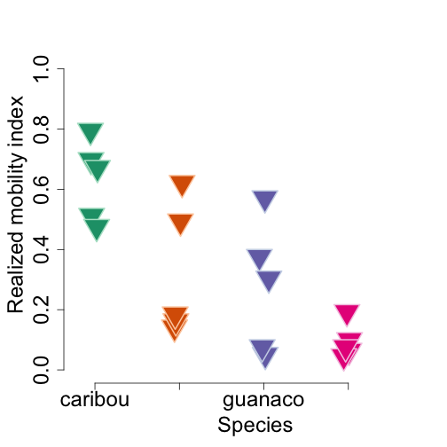

<!--
%\VignetteEngine{knitr::docco_classic}
%\VignetteIndexEntry{An Introduction to the corrplot package}
-->

An Introduction to the **'animalmove'** package
=======================================


Introduction
------------


The  **animalmove** package provides a series statistical analyses of the spatio-temporal animal movement patterns at the population level.
The package implement analyses described in the original paper **"How landscape dynamics link individualto population-level movement patterns:a multispecies comparison of ungulate relocation data"** (Mueller T., et. al, 2011).


Statistical Analyses
----------------------------


There are three statistical analyses in the package: 

* Realized Mobility Index
* Movement Coordination Index
* Population Dispersion Index

Each of the analyses incorporates the methodology described in the paper, and produces a numerical outcome, which can assesed by the examining the result set or summarized and visualized the custom summaries and high-level functions.

The analyses assume the relocation data of multiple species are preliminary syncronized and preprocessed by time and space dimensions.

We start with the import of the library **animalmove** in R environment. The package can be installed in the local system from the source package archive for OS X or Win platform.

Package installation
----------------------------

Build Package from source

* In the project directory run:
    * "R CMD BUILD ."

    Optional
      Set environment variable _R_CHECK_FORCE_SUGGESTS_ to false to avoid errors related to Suggest entry in the namespace
      export _R_CHECK_FORCE_SUGGESTS_=FALSE


* Unpack the source package in the directory on the local file system
    * In the project directory run:
    R CMD INSTALL .


```r

# Load library
library(animalmove)
```

```
## Loading required package: chron
## Loading required package: splancs
## Loading required package: sp
## 
## Spatial Point Pattern Analysis Code in S-Plus
##  
##  Version 2 - Spatial and Space-Time analysis
## 
## Loading required package: adehabitatHR
## Loading required package: deldir
## deldir 0.1-5
## Loading required package: ade4
## Loading required package: adehabitatMA
## Loading required package: adehabitatLT
## Loading required package: CircStats
## Loading required package: MASS
## Loading required package: boot
## Loading required package: sciplot
## Loading required package: lme4
## Loading required package: lattice
## 
## Attaching package: 'lattice'
## 
## The following object is masked from 'package:boot':
## 
##     melanoma
## 
## Loading required package: Matrix
## Loading required package: languageR
## Loading required package: Hmisc
## Loading required package: grid
## Loading required package: survival
## Loading required package: splines
## 
## Attaching package: 'survival'
## 
## The following object is masked from 'package:boot':
## 
##     aml
## 
## Loading required package: Formula
## 
## Attaching package: 'Hmisc'
## 
## The following object is masked from 'package:splancs':
## 
##     zoom
## 
## The following objects are masked from 'package:base':
## 
##     format.pval, round.POSIXt, trunc.POSIXt, units
## 
## Loading required package: rgdal
## rgdal: version: 0.8-16, (SVN revision 498)
## Geospatial Data Abstraction Library extensions to R successfully loaded
## Loaded GDAL runtime: GDAL 1.9.2, released 2012/10/08
## Path to GDAL shared files: /Library/Frameworks/R.framework/Versions/3.0/Resources/library/rgdal/gdal
## Loaded PROJ.4 runtime: Rel. 4.8.0, 6 March 2012, [PJ_VERSION: 480]
## Path to PROJ.4 shared files: /Library/Frameworks/R.framework/Versions/3.0/Resources/library/rgdal/proj
## Loading required package: sqldf
## Loading required package: DBI
## Loading required package: gsubfn
## Loading required package: proto
## Loading required namespace: tcltk
## Loading required package: RSQLite
## Loading required package: RSQLite.extfuns
## Loading required package: data.table
## Loading required package: RColorBrewer
```

```
## Warning: replacing previous import by 'Hmisc::label' when loading 'animalmove'
## Warning: replacing previous import by 'Hmisc::zoom' when loading 'animalmove'
```


Data Import
-----------------------------
The data can be imported in R using conventional form of reading data from csv/text files, and transforming them in *Individuals* object data frame.


```r
# Read data the sample data set is located in misc directory of the source
# archive.

caribou <- read.csv("/apps/git/animalmove/misc/originaldata/16_day_5_individuals_data_Caribou.csv")
gazelle <- read.csv("/apps/git/animalmove/misc/originaldata/16_day_5_individuals_data_Gazelle.csv")
moose <- read.csv("/apps/git/animalmove/misc/originaldata/16_day_5_individuals_data_Moose.csv")
guanaco <- read.csv("/apps/git/animalmove/misc/originaldata/16_day_5_individuals_data_Gaunaco.csv")
```


```r

# Load Data

# Caribou data

# Copy caribou data to the data table
dt.caribou <- data.table(caribou)

# Create attribute data frame
dt.caribou.attr <- dt.caribou[, list(id = uniqueID, pop.type = "caribou", x = xAlaskaAlb * 
    1000, y = caribou$yAlaskaAlb * 1000, time.lag = daysToFind)]

# Gazelle data

# Copy gazelle data to the data table
dt.gazelle <- data.table(gazelle)

# Create attribute data frame
dt.gazelle.attr <- dt.gazelle[, list(id = id, pop.type = "gazelle", x = xm * 
    1000, y = ym * 1000, time.lag = daysToFind)]

# Load Moose data

# Copy moose data to the data table
dt.moose <- data.table(moose)

# Create attribute data frame
dt.moose.attr <- dt.moose[, list(id = uniqueID, pop.type = "moose", x = xm * 
    1000, y = ym * 1000, time.lag = daysToFind)]

# Load guanaco data

# Copy guanaco data to the data table
dt.guanaco <- data.table(guanaco)


# Create attribute data frame
dt.guanaco.attr <- dt.guanaco[, list(id = uniqueID, pop.type = "guanaco", x = xm * 
    1000, y = ym * 1000, time.lag = daysToFind)]
allpopulations <- rbind(dt.caribou.attr, dt.gazelle.attr, dt.moose.attr, dt.guanaco.attr)

# save data

# save(allpopulations, file='/apps/git/animalmove/data/allpopulations.rda')

# Create spatial coordinates

dt.allpopulations <- data.table(allpopulations)

dt.allpopulations.xy <- dt.allpopulations[, list(x, y)]

str(dt.allpopulations.xy)
```

```
## Classes 'data.table' and 'data.frame':	310 obs. of  2 variables:
##  $ x: num  620673 597224 575563 411808 372566 ...
##  $ y: num  2188198 2173363 2179598 2193228 2190453 ...
##  - attr(*, ".internal.selfref")=<externalptr>
```

```r

dt.allpopulations.attr <- dt.allpopulations[, list(id, pop.type, time.lag)]

# Create spatial points
xy.sp.allpopulations <- SpatialPoints(dt.allpopulations.xy)

# Create spatial points data frame with attributes
xy.allpopulations.spdf <- SpatialPointsDataFrame(xy.sp.allpopulations, dt.allpopulations.attr)
str(xy.allpopulations.spdf)
```

```
## Formal class 'SpatialPointsDataFrame' [package "sp"] with 5 slots
##   ..@ data       :'data.frame':	310 obs. of  3 variables:
##   .. ..$ id      : Factor w/ 20 levels "583657","601607",..: 13 13 13 13 13 13 13 13 13 13 ...
##   .. ..$ pop.type: chr [1:310] "caribou" "caribou" "caribou" "caribou" ...
##   .. ..$ time.lag: int [1:310] 105 121 137 153 169 185 201 217 233 249 ...
##   ..@ coords.nrs : num(0) 
##   ..@ coords     : num [1:310, 1:2] 620673 597224 575563 411808 372566 ...
##   .. ..- attr(*, "dimnames")=List of 2
##   .. .. ..$ : NULL
##   .. .. ..$ : chr [1:2] "x" "y"
##   ..@ bbox       : num [1:2, 1:2] -820509 -511436 1821501 2242778
##   .. ..- attr(*, "dimnames")=List of 2
##   .. .. ..$ : chr [1:2] "x" "y"
##   .. .. ..$ : chr [1:2] "min" "max"
##   ..@ proj4string:Formal class 'CRS' [package "sp"] with 1 slots
##   .. .. ..@ projargs: chr NA
```

```r

# Create Individuals data.frame - relocations of gazelle data
allpopulations.spatial <- Individuals(xy.allpopulations.spdf, group.by = "pop.type")

# save(allpopulations.spatial,
# file='/apps/git/animalmove/data/allpopulations.spatial.rda')

# End Load Data
```


Realized Mobility Index
----------------------------

```r

# Realized Mobility Index
data(allpopulations.spatial)

# compute individual mcp
individual.mcp <- mcp(allpopulations.spatial[, 1], percent = 100)

# display mcp
individual.mcp
```

```
## Object of class "SpatialPolygonsDataFrame" (package sp):
## 
## Number of SpatialPolygons:  20
## 
## Variables measured:
##            id    area
## 583657 583657 2780300
## 601607 601607  631006
## 602189 602189 2208462
## 602190 602190  723942
## 602191 602191  825206
## F6         F6    2796
## ...
```

```r

# compute population mcp
population.mcp <- mcp.population(allpopulations.spatial, percent = 100)

# display mcp
population.mcp
```

```
## Object of class "SpatialPolygonsDataFrame" (package sp):
## 
## Number of SpatialPolygons:  4
## 
## Variables measured:
##              id     area
## caribou caribou 10768516
## gazelle gazelle  4477248
## guanaco guanaco   162400
## moose     moose    28201
```

```r

# compute RMIndex object that is a data.frame

rmi.index.pop <- rmi.index(allpopulations.spatial, percent = 100, id = "id")
```

```
## Loading required package: tcltk
```

```r

rmi.object <- RMIndex(rmi.index.pop)

# RMI Data
rmi.object@data
```

```
##          id pop.type ind.home.range pop.home.range rmi.index
## 1    583657  gazelle        2780300        4477248   0.62098
## 2    601607  gazelle         631006        4477248   0.14094
## 3    602189  gazelle        2208462        4477248   0.49326
## 4    602190  gazelle         723942        4477248   0.16169
## 5    602191  gazelle         825206        4477248   0.18431
## 6        F6    moose           2796          28201   0.09914
## 7   Iris474  guanaco          92608         162400   0.57025
## 8        M4    moose           1794          28201   0.06362
## 9        M6    moose           5416          28201   0.19207
## 10       M7    moose           1285          28201   0.04558
## 11       M8    moose           2129          28201   0.07550
## 12  Name213  guanaco          60964         162400   0.37539
## 13  S435891  caribou        5511582       10768516   0.51182
## 14  S515876  caribou        7507306       10768516   0.69715
## 15  S587873  caribou        5115407       10768516   0.47503
## 16  S597881  caribou        7225956       10768516   0.67103
## 17  S617880  caribou        8555763       10768516   0.79452
## 18  caro514  guanaco          49301         162400   0.30358
## 19 pablo097  guanaco           8118         162400   0.04999
## 20    su394  guanaco          12238         162400   0.07536
```

```r

summary(rmi.object)
```

```
## $caribou
##    Min. 1st Qu.  Median    Mean 3rd Qu.    Max. 
##   0.475   0.512   0.671   0.630   0.697   0.795 
## 
## $gazelle
##    Min. 1st Qu.  Median    Mean 3rd Qu.    Max. 
##   0.141   0.162   0.184   0.320   0.493   0.621 
## 
## $guanaco
##    Min. 1st Qu.  Median    Mean 3rd Qu.    Max. 
##  0.0500  0.0754  0.3040  0.2750  0.3750  0.5700 
## 
## $moose
##    Min. 1st Qu.  Median    Mean 3rd Qu.    Max. 
##  0.0456  0.0636  0.0755  0.0952  0.0991  0.1920
```

```r

par(mar = c(5, 5, 2, 0))
plot(rmi.object)
```



```r

# End Realized Mobility Index
```


Movement Coordination Index
----------------------------


```r

data(puechabonsp)

ind.ds <- puechabonsp
ind.reloc <- ind.ds$relocs
ind.reloc@data$type <- "type1"
ind.reloc@data[1:50, 5] <- "type2"
head(ind.reloc, 53)
```

```
##          coordinates  Name Age Sex   Date  type
## 1  (699889, 3161560) Brock   2   1 930701 type2
## 2  (700046, 3161540) Brock   2   1 930703 type2
## 3  (698840, 3161030) Brock   2   1 930706 type2
## 4  (699809, 3161500) Brock   2   1 930707 type2
## 5  (698627, 3160940) Brock   2   1 930708 type2
## 6  (698719, 3160990) Brock   2   1 930709 type2
## 7  (698991, 3161020) Brock   2   1 930713 type2
## 8  (698626, 3160770) Brock   2   1 930714 type2
## 9  (698879, 3160960) Brock   2   1 930715 type2
## 10 (699756, 3161450) Brock   2   1 930720 type2
## 11 (699006, 3160990) Brock   2   1 930723 type2
## 12 (700387, 3161440) Brock   2   1 930724 type2
## 13 (698705, 3160820) Brock   2   1 930726 type2
## 14 (698974, 3160880) Brock   2   1 930728 type2
## 15 (698937, 3160970) Brock   2   1 930729 type2
## 16 (698987, 3161000) Brock   2   1 930730 type2
## 17 (699888, 3161510) Brock   2   1 930801 type2
## 18 (698797, 3160940) Brock   2   1 930803 type2
## 19 (698791, 3160990) Brock   2   1 930807 type2
## 20 (699535, 3161250) Brock   2   1 930809 type2
## 21 (699406, 3161330) Brock   2   1 930810 type2
## 22 (699461, 3161170) Brock   2   1 930813 type2
## 23 (699529, 3161230) Brock   2   1 930816 type2
## 24 (698992, 3161040) Brock   2   1 930819 type2
## 25 (698905, 3160910) Brock   2   1 930821 type2
## 26 (699474, 3161190) Brock   2   1 930822 type2
## 27 (699367, 3161100) Brock   2   1 930827 type2
## 28 (698689, 3160850) Brock   2   1 930829 type2
## 29 (699341, 3161110) Brock   2   1 930830 type2
## 30 (699207, 3161100) Brock   2   1 930831 type2
## 31 (700098, 3161650) Calou   2   1 930703 type2
## 32 (700310, 3161320) Calou   2   1 930704 type2
## 33 (699877, 3161470) Calou   2   1 930707 type2
## 34 (700003, 3161360) Calou   2   1 930708 type2
## 35 (699820, 3161390) Calou   2   1 930709 type2
## 36 (699778, 3161330) Calou   2   1 930711 type2
## 37 (700419, 3161480) Calou   2   1 930718 type2
## 38 (700261, 3161580) Calou   2   1 930720 type2
## 39 (699797, 3161400) Calou   2   1 930725 type2
## 41 (700344, 3161520) Calou   2   1 930803 type2
## 42 (700355, 3161430) Calou   2   1 930806 type2
## 43 (700301, 3161480) Calou   2   1 930810 type2
## 44 (700040, 3161040) Calou   2   1 930812 type2
## 45 (699855, 3160550) Calou   2   1 930819 type2
## 46 (700022, 3160750) Calou   2   1 930821 type2
## 47 (699656, 3161130) Calou   2   1 930823 type2
## 48 (700122, 3160700) Calou   2   1 930828 type2
## 49 (700266, 3161520) Calou   2   1 930830 type2
## 50 (700010, 3161680) Calou   2   1 930831 type2
## 51 (699520, 3159570)  Chou   3   2 920729 type2
## 52 (699640, 3158700)  Chou   3   2 920802 type1
## 53 (699689, 3158860)  Chou   3   2 920803 type1
## 54 (699670, 3158840)  Chou   3   2 920804 type1
## Coordinate Reference System (CRS) arguments: NA
```

```r

pop.data <- Individuals(ind.reloc, group.by = c("type"))

pop.data@data$time.lag <- 365
pop.data@data[1:50, 6] <- 200

# display data population data
str(pop.data)
```

```
## Formal class 'Individuals' [package "animalmove"] with 6 slots
##   ..@ group.by   : chr "type"
##   ..@ data       :'data.frame':	119 obs. of  6 variables:
##   .. ..$ Name    : Factor w/ 4 levels "Brock","Calou",..: 1 1 1 1 1 1 1 1 1 1 ...
##   .. ..$ Age     : int [1:119] 2 2 2 2 2 2 2 2 2 2 ...
##   .. ..$ Sex     : int [1:119] 1 1 1 1 1 1 1 1 1 1 ...
##   .. ..$ Date    : int [1:119] 930701 930703 930706 930707 930708 930709 930713 930714 930715 930720 ...
##   .. ..$ type    : chr [1:119] "type2" "type2" "type2" "type2" ...
##   .. ..$ time.lag: num [1:119] 200 200 200 200 200 200 200 200 200 200 ...
##   ..@ coords.nrs : num(0) 
##   ..@ coords     : num [1:119, 1:2] 699889 700046 698840 699809 698627 ...
##   .. ..- attr(*, "dimnames")=List of 2
##   .. .. ..$ : chr [1:119] "1" "2" "3" "4" ...
##   .. .. ..$ : chr [1:2] "X" "Y"
##   ..@ bbox       : num [1:2, 1:2] 698626 3157848 701410 3161678
##   .. ..- attr(*, "dimnames")=List of 2
##   .. .. ..$ : chr [1:2] "X" "Y"
##   .. .. ..$ : chr [1:2] "min" "max"
##   ..@ proj4string:Formal class 'CRS' [package "sp"] with 1 slots
##   .. .. ..@ projargs: chr NA
```

```r

head(pop.data)
```

```
##         coordinates  Name Age Sex   Date  type time.lag
## 1 (699889, 3161560) Brock   2   1 930701 type2      200
## 2 (700046, 3161540) Brock   2   1 930703 type2      200
## 3 (698840, 3161030) Brock   2   1 930706 type2      200
## 4 (699809, 3161500) Brock   2   1 930707 type2      200
## 5 (698627, 3160940) Brock   2   1 930708 type2      200
## 6 (698719, 3160990) Brock   2   1 930709 type2      200
## Coordinate Reference System (CRS) arguments: NA
```

```r

group.by = colnames(populations(pop.data))
index.group.by = grep(group.by, colnames(pop.data@data))

# test - call using generic method
res.ind <- mci.index(pop.data, group.by = c("type"), time.lag = c("time.lag"))

# display data
head(res.ind)
```

```
##   time.lag pop.type mci.index
## 1      200    type2    0.9996
## 2      200    type2    0.9996
## 3      200    type2    0.9996
## 4      200    type2    0.9996
## 5      200    type2    0.9996
## 6      200    type2    0.9996
```

```r


# Create MCIndex object
mci.object <- MCIndex(res.ind)

# Compute ANOVA stats

anova.model <- aov(mci.object)

# display anova
anova.model
```

```
## Call:
##    aov(formula = mci.index ~ species, data = data)
## 
## Terms:
##                   species Residuals
## Sum of Squares  5.944e-07 0.000e+00
## Deg. of Freedom         1       117
## 
## Residual standard error: 2.087e-15
## Estimated effects may be unbalanced
```

```r

# TukeyHSD from model
TukeyHSD(anova.model)
```

```
##   Tukey multiple comparisons of means
##     95% family-wise confidence level
## 
## Fit: aov(formula = mci.index ~ species, data = data)
## 
## $species
##                   diff        lwr        upr p adj
## type2-type1 -0.0001432 -0.0001432 -0.0001432     0
```


Population Dispersion Index
----------------------------


```r
# Population Dispersion Index

# load data
data(caribou.reloc.16day.5indiv)
data(gazelle.reloc.16day.5indiv)
data(moose.reloc.16day.5indiv)
data(guanaco.reloc.16day.5indiv)

caribou.scale = seq(0, 1e+05, 5000)  #caribou and gazelles
gazelle.scale = caribou.scale
moose.scale = seq(0, 10000, 500)  #moose
guanaco.scale = seq(0, 15000, 500)  #guanaco


# create PDIndex for each specie
pdi.index.caribou <- pdi.index(caribou.reloc.16day.5indiv, percent = 100, caribou.scale, 
    unin = "m", unout = "km2")
pdi.index.gazelle <- pdi.index(gazelle.reloc.16day.5indiv, percent = 100, gazelle.scale, 
    unin = "m", unout = "km2")
pdi.index.guanaco <- pdi.index(guanaco.reloc.16day.5indiv, percent = 100, guanaco.scale, 
    unin = "m", unout = "km2")
pdi.index.moose <- pdi.index(moose.reloc.16day.5indiv, percent = 100, moose.scale, 
    unin = "m", unout = "km2")

# Get summaries of each specie PDI

summary.caribou <- summary.pdi(pdi.index.caribou)
summary.gazelle <- summary.pdi(pdi.index.gazelle)
summary.guanaco <- summary.pdi(pdi.index.guanaco)
summary.moose <- summary.pdi(pdi.index.moose)

# Create X and Y axes for each species

# caribou
caribou.X <- c(summary.caribou$scale, rev(summary.caribou$scale))
caribou.Y <- c(summary.caribou$mean.pdi + summary.caribou$se.pdi, rev(summary.caribou$mean.pdi - 
    summary.caribou$se.pdi))

# gazelle
gazelle.X <- c(summary.gazelle$scale, rev(summary.gazelle$scale))
gazelle.Y <- c(summary.gazelle$mean.pdi + summary.gazelle$se.pdi, rev(summary.gazelle$mean.pdi - 
    summary.gazelle$se.pdi))

# guanaco
guanaco.X <- c(summary.guanaco$scale, rev(summary.guanaco$scale))
guanaco.Y <- c(summary.guanaco$mean.pdi + summary.guanaco$se.pdi, rev(summary.guanaco$mean.pdi - 
    summary.guanaco$se.pdi))

# moose
moose.X <- c(summary.moose$scale, rev(summary.moose$scale))
moose.Y <- c(summary.moose$mean.pdi + summary.moose$se.pdi, rev(summary.moose$mean.pdi - 
    summary.moose$se.pdi))


# Plot default settings

colorCaribou = "pink"
colorGazelle = "lightblue"
colorGuanaco = "khaki1"  #'#FFFF99'
colorMoose = "lightgreen"
colorCaribou2 = "red"
colorGazelle2 = "blue"
colorGuanaco2 = "darkorange"
colorMoose2 = "darkgreen"

cexValue = 2

cexValue = 1

# Change number of panels in the plotting window back to a single panel
par(mfrow = c(1, 1))

# Change margin size par(mar = c(5, 5, 2, 1))

# Create empty plot, with axes labels
plot(caribou.scale, summary.gazelle$mean.pdi, ylim = c(-25000, 5000), xlim = c(0, 
    50000), col = NA, ylab = "Population Dispersion Index", xlab = "lag (km)", 
    cex.lab = cexValue, cex.axis = cexValue, cex = cexValue, axes = F)

# Add caribou data
polygon(caribou.X, caribou.Y, col = colorCaribou, border = NA)  # plots CI's

# Add gazelle data
polygon(gazelle.X, gazelle.Y, col = colorGazelle, border = NA)  # plots CI's

# Add Moose data
polygon(moose.X, moose.Y, col = colorMoose, border = NA)  # plots CI's

# Add guanaco data
polygon(guanaco.X, guanaco.Y, col = colorGuanaco, border = NA)  # plots CI's


# Add lines
lines(summary.caribou$scale, summary.caribou$mean.pdi, col = colorCaribou2, 
    lwd = 2)  # plots PDI
lines(summary.gazelle$scale, summary.gazelle$mean.pdi, col = colorGazelle2, 
    lwd = 2)  # plots PDI
lines(summary.moose$scale, summary.moose$mean.pdi, col = colorMoose2, lwd = 2)  # plots PDI
lines(summary.guanaco$scale, summary.guanaco$mean.pdi, col = colorGuanaco2, 
    lwd = 2)  # plots PDI


lines(c(0, 1e+05), c(0, 0), lwd = 2, lty = 1)  # add baseline

# Add axes
axis(1, at = seq(0, 50000, 10000), labels = seq(0, 50, 10), cex.axis = cexValue)
axis(2, at = seq(-25000, 5000, 10000), cex.axis = cexValue)

# Add legend
legend(-1000, -18000, legend = c("Caribou (C)", "M. gazelle (MG)", "Guanaco (G)", 
    "Moose (M)"), col = c(colorCaribou2, colorGazelle2, colorGuanaco2, colorMoose2), 
    box.lty = 0, lty = 1, lwd = 3, cex = cexValue, bg = NA)
```


```r
par(mfrow = c(2, 2))
par(cex = 0.35)
plot(pdi.index.caribou, col = colorCaribou, linecol = colorCaribou2, title = "Spatial Population Dispersion - Caribou, Kilometers")
plot(pdi.index.gazelle, col = colorGazelle, linecol = colorGazelle2, title = "Spatial Population Dispersion - Gazelle, Kilometers")
plot(pdi.index.moose, col = colorMoose, linecol = colorMoose2, title = "Spatial Population Dispersion - Moose, Kilometers")
plot(pdi.index.guanaco, col = colorGuanaco, linecol = colorGuanaco2, title = "Spatial Population Dispersion - Guanaco, Kilometers")
```


