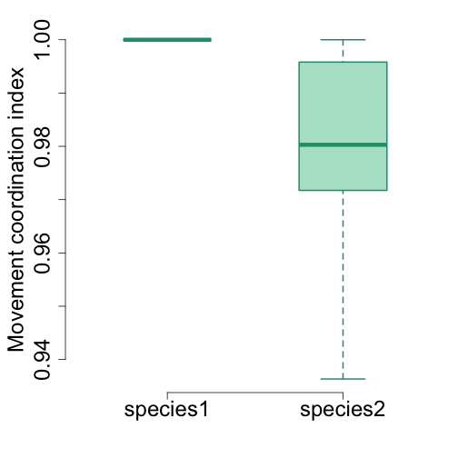
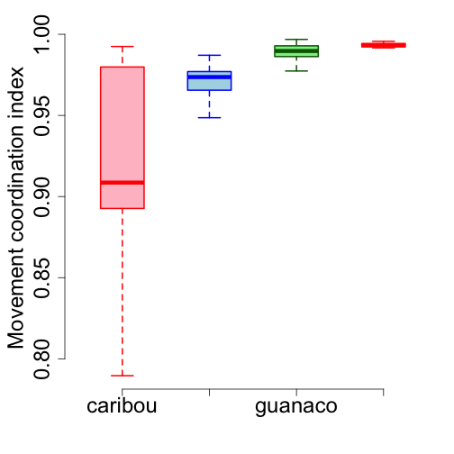

<!--
%\VignetteEngine{knitr::docco_classic}
%\VignetteIndexEntry{An Introduction to the animalmove package}
-->

Movement Coordination Index
=======================================


Load package library

```r
library(animalmove)
```


Subsample Data
------------

Khulan dataset has been saved in the package data directory , and loaded on the package load.

Raw **khulan** dataset contains unlaltered original data.


```r
data(khulan.raw.data)
head(khulan.raw.data)
```

```
##   id    sex                time      X       Y   lat   lon age elevation
## 1  3 female 2009-07-20 12:47:00 498117 5026295 45.39 92.98 5-6      1361
## 2  3 female 2009-07-20 12:59:00 494908 5026062 45.39 92.93 5-6      1359
## 3  3 female 2009-07-20 13:12:00 493784 5026159 45.39 92.92 5-6      1357
## 4  3 female 2009-07-20 13:25:00 493014 5026142 45.39 92.91 5-6      1357
## 5  3 female 2009-07-20 13:38:00 492374 5026252 45.39 92.90 5-6      1353
## 6  3 female 2009-07-20 13:51:00 491814 5026458 45.39 92.90 5-6      1353
##   vegetation behaviour  unixTime
## 1          9           1.248e+09
## 2          9       TRA 1.248e+09
## 3          9       TRA 1.248e+09
## 4         10       TRA 1.248e+09
## 5          6       TRA 1.248e+09
## 6          9       TRA 1.248e+09
```


Number of rows in the khulan.raw.data

```r
nrow(khulan.raw.data)
```

```
## [1] 222632
```


For demonstration purposes we add a column that indicates a specie type to the data frame for each relocation data.

Enhanced dataset has been saved into khulan.test.data a column pop.type, which indicates a specie type.

Specie type assignment rule:  Individuals with ids 3,4,7, 6441 assigned to the specie1 type, and the rest is identified as specie2 type.


```r
data(khulan.test.data)
head(khulan.test.data)
```

```
##    id    sex                time      X       Y   lat   lon age elevation
## 1:  3 female 2009-07-20 12:47:00 498117 5026295 45.39 92.98 5-6      1361
## 2:  3 female 2009-07-20 12:59:00 494908 5026062 45.39 92.93 5-6      1359
## 3:  3 female 2009-07-20 13:12:00 493784 5026159 45.39 92.92 5-6      1357
## 4:  3 female 2009-07-20 13:25:00 493014 5026142 45.39 92.91 5-6      1357
## 5:  3 female 2009-07-20 13:38:00 492374 5026252 45.39 92.90 5-6      1353
## 6:  3 female 2009-07-20 13:51:00 491814 5026458 45.39 92.90 5-6      1353
##    vegetation behaviour  unixTime pop.type
## 1:          9           1.248e+09 species1
## 2:          9       TRA 1.248e+09 species1
## 3:          9       TRA 1.248e+09 species1
## 4:         10       TRA 1.248e+09 species1
## 5:          6       TRA 1.248e+09 species1
## 6:          9       TRA 1.248e+09 species1
```


Number of rows in the khulan.test.data


```r
nrow(khulan.test.data)
```

```
## [1] 222632
```


### Subsample data within time interval
--------------------------------------

We select at most 6 individuals within 2009, time interval 50 hours, and accuracy 50 hours, and subsampling scheme for Realized Mobility Index

```r
mci.data <- subsample(khulan.test.data, start = c("2009-01-01 00:00"), end = "2009-12-31 00:00", 
    interval = c("50 hours"), accuracy = c("3 mins"), minIndiv = 3, maxIndiv = 6, 
    mustIndiv = NULL, index.type = "mci")

head(mci.data)
```

```
##   overlapID           scantimes   id    sex                time      X
## 1       100 2009-07-26 06:00:00    3 female 2009-07-26 06:00:00 481551
## 2       100 2009-07-26 06:00:00 6441   male 2009-07-26 06:00:00 546746
## 3       100 2009-07-26 06:00:00 6446 female 2009-07-26 06:00:00 506485
## 4       100 2009-07-26 06:00:00 7376 female 2009-07-26 06:00:00 508983
## 5       102 2009-07-30 10:00:00    3 female 2009-07-30 09:57:00 480753
## 6       102 2009-07-30 10:00:00 6441   male 2009-07-30 10:00:00 545652
##         Y   lat   lon age elevation vegetation behaviour  unixTime
## 1 5023605 45.37 92.76 5-6      1373          9       GRA 1.249e+09
## 2 5014428 45.28 93.60  15      1591          9       GRA 1.249e+09
## 3 5040413 45.52 93.08  15      1536          6       RST 1.249e+09
## 4 5011316 45.26 93.11 2-3      1560         10       TRA 1.249e+09
## 5 5030332 45.43 92.75 5-6      1300          9       TRA 1.249e+09
## 6 5013327 45.27 93.58  15      1608          9       GRA 1.249e+09
##   pop.type   time.lag
## 1 species1 2.083 days
## 2 species1 2.083 days
## 3 species2 2.083 days
## 4 species2 2.083 days
## 5 species1 6.248 days
## 6 species1 6.250 days
```


Note, a number of rows in the mci subsample dataset


```r
nrow(mci.data)
```

```
## [1] 144
```


### Prepare data for the analysis in the spatial form
----------------------------

Create attribute data frame


```r
dt.mci.data <- data.table(mci.data)

dt.mci.data.attr <- dt.mci.data[, list(id = id, pop.type = pop.type, x = X, 
    y = Y, time = time, time.lag = time.lag, age = age, elevation = elevation, 
    behaviour = behaviour)]
str(dt.mci.data.attr)
```

```
## Classes 'data.table' and 'data.frame':	144 obs. of  9 variables:
##  $ id       : int  3 6441 6446 7376 3 6441 6446 7376 3 6441 ...
##  $ pop.type : chr  "species1" "species1" "species2" "species2" ...
##  $ x        : num  481551 546746 506485 508983 480753 ...
##  $ y        : num  5023605 5014428 5040413 5011316 5030332 ...
##  $ time     : POSIXct, format: "2009-07-26 06:00:00" "2009-07-26 06:00:00" ...
##  $ time.lag :Class 'difftime'  atomic [1:144] 2.08 2.08 2.08 2.08 6.25 ...
##   .. ..- attr(*, "tzone")= chr "GMT"
##   .. ..- attr(*, "units")= chr "days"
##  $ age      : Factor w/ 5 levels "12","15","2-3",..: 5 2 2 3 5 2 2 3 5 2 ...
##  $ elevation: int  1373 1591 1536 1560 1300 1608 1448 1531 1329 1596 ...
##  $ behaviour: Factor w/ 4 levels "","GRA","RST",..: 2 2 3 4 4 2 2 2 2 3 ...
##  - attr(*, ".internal.selfref")=<externalptr>
```


Create spatial coordinates

```r
dt.mci.data.spatial <- dt.mci.data[, list(x = X, y = Y)]
str(dt.mci.data.spatial)
```

```
## Classes 'data.table' and 'data.frame':	144 obs. of  2 variables:
##  $ x: num  481551 546746 506485 508983 480753 ...
##  $ y: num  5023605 5014428 5040413 5011316 5030332 ...
##  - attr(*, ".internal.selfref")=<externalptr>
```


Create spatial points

```r
xy.sp.mci.data <- SpatialPoints(dt.mci.data.spatial)
```


Create spatial points data frame with attributes

```r
xy.mci.data.spdf <- SpatialPointsDataFrame(xy.sp.mci.data, dt.mci.data.attr)
str(xy.mci.data.spdf)
```

```
## Formal class 'SpatialPointsDataFrame' [package "sp"] with 5 slots
##   ..@ data       :'data.frame':	144 obs. of  9 variables:
##   .. ..$ id       : int [1:144] 3 6441 6446 7376 3 6441 6446 7376 3 6441 ...
##   .. ..$ pop.type : chr [1:144] "species1" "species1" "species2" "species2" ...
##   .. ..$ x        : num [1:144] 481551 546746 506485 508983 480753 ...
##   .. ..$ y        : num [1:144] 5023605 5014428 5040413 5011316 5030332 ...
##   .. ..$ time     : POSIXct[1:144], format: "2009-07-26 06:00:00" ...
##   .. ..$ time.lag :Class 'difftime'  atomic [1:144] 2.08 2.08 2.08 2.08 6.25 ...
##   .. .. .. ..- attr(*, "tzone")= chr "GMT"
##   .. .. .. ..- attr(*, "units")= chr "days"
##   .. ..$ age      : Factor w/ 5 levels "12","15","2-3",..: 5 2 2 3 5 2 2 3 5 2 ...
##   .. ..$ elevation: int [1:144] 1373 1591 1536 1560 1300 1608 1448 1531 1329 1596 ...
##   .. ..$ behaviour: Factor w/ 4 levels "","GRA","RST",..: 2 2 3 4 4 2 2 2 2 3 ...
##   ..@ coords.nrs : num(0) 
##   ..@ coords     : num [1:144, 1:2] 481551 546746 506485 508983 480753 ...
##   .. ..- attr(*, "dimnames")=List of 2
##   .. .. ..$ : NULL
##   .. .. ..$ : chr [1:2] "x" "y"
##   ..@ bbox       : num [1:2, 1:2] 377094 4990393 546788 5043350
##   .. ..- attr(*, "dimnames")=List of 2
##   .. .. ..$ : chr [1:2] "x" "y"
##   .. .. ..$ : chr [1:2] "min" "max"
##   ..@ proj4string:Formal class 'CRS' [package "sp"] with 1 slots
##   .. .. ..@ projargs: chr NA
```


Create Individuals data.frame - relocations of khulan data

```r
khulan.reloc.spatial <- Individuals(xy.mci.data.spdf, group.by = "pop.type")
str(khulan.reloc.spatial)
```

```
## Formal class 'Individuals' [package "animalmove"] with 6 slots
##   ..@ group.by   : chr "pop.type"
##   ..@ data       :'data.frame':	144 obs. of  9 variables:
##   .. ..$ id       : int [1:144] 3 6441 6446 7376 3 6441 6446 7376 3 6441 ...
##   .. ..$ pop.type : chr [1:144] "species1" "species1" "species2" "species2" ...
##   .. ..$ x        : num [1:144] 481551 546746 506485 508983 480753 ...
##   .. ..$ y        : num [1:144] 5023605 5014428 5040413 5011316 5030332 ...
##   .. ..$ time     : POSIXct[1:144], format: "2009-07-26 06:00:00" ...
##   .. ..$ time.lag :Class 'difftime'  atomic [1:144] 2.08 2.08 2.08 2.08 6.25 ...
##   .. .. .. ..- attr(*, "tzone")= chr "GMT"
##   .. .. .. ..- attr(*, "units")= chr "days"
##   .. ..$ age      : Factor w/ 5 levels "12","15","2-3",..: 5 2 2 3 5 2 2 3 5 2 ...
##   .. ..$ elevation: int [1:144] 1373 1591 1536 1560 1300 1608 1448 1531 1329 1596 ...
##   .. ..$ behaviour: Factor w/ 4 levels "","GRA","RST",..: 2 2 3 4 4 2 2 2 2 3 ...
##   ..@ coords.nrs : num(0) 
##   ..@ coords     : num [1:144, 1:2] 481551 546746 506485 508983 480753 ...
##   .. ..- attr(*, "dimnames")=List of 2
##   .. .. ..$ : NULL
##   .. .. ..$ : chr [1:2] "x" "y"
##   ..@ bbox       : num [1:2, 1:2] 377094 4990393 546788 5043350
##   .. ..- attr(*, "dimnames")=List of 2
##   .. .. ..$ : chr [1:2] "x" "y"
##   .. .. ..$ : chr [1:2] "min" "max"
##   ..@ proj4string:Formal class 'CRS' [package "sp"] with 1 slots
##   .. .. ..@ projargs: chr NA
```


Analysis - Khulan data
----------------------------

### Compute MCI 
-----------------------------


```r
mci.khulan <- mci.index(khulan.reloc.spatial, group.by = c("pop.type"), time.lag = c("time.lag"))
mci.khulan.object <- MCIndex(mci.khulan)
mci.khulan.object
```

```
## An object of class "MCIndex"
## Slot "data":
##         time.lag pop.type mci.index
## 1     2.083 days species1    0.9678
## 2     2.083 days species1    0.9678
## 3     2.083 days species2    0.9973
## 4     2.083 days species2    0.9973
## 5     6.248 days species1    1.0000
## 6     6.250 days species1    1.0000
## 7     6.250 days species2    0.9742
## 8     6.250 days species2    0.9742
## 9     8.333 days species1    1.0000
## 10    8.333 days species1    1.0000
## 11    8.333 days species2    0.9684
## 12    8.333 days species2    0.9684
## 13   12.499 days species1    1.0000
## 14   12.500 days species1    1.0000
## 15   12.500 days species2    0.9625
## 16   12.500 days species2    0.9625
## 17   14.584 days species1    1.0000
## 18   14.583 days species1    1.0000
## 19   14.583 days species2    1.0000
## 20   14.585 days species2    1.0000
## 21   18.749 days species1    1.0000
## 22   18.750 days species1    1.0000
## 23   18.750 days species2    0.9716
## 24   18.750 days species2    0.9716
## 25   22.917 days species1    0.9982
## 26   22.917 days species1    0.9982
## 27   22.917 days species2    0.9719
## 28   22.917 days species2    0.9719
## 29   24.998 days species1    1.0000
## 30   25.000 days species1    1.0000
## 31   25.000 days species2    0.9755
## 32   25.000 days species2    0.9755
## 33   27.083 days species1    0.9952
## 34   27.083 days species1    0.9952
## 35   27.083 days species2    0.9758
## 36   27.083 days species2    0.9758
## 37   31.249 days species1    1.0000
## 38   31.250 days species1    1.0000
## 39   31.250 days species2    0.9774
## 40   31.250 days species2    0.9774
## 41   37.499 days species1    1.0000
## 42   37.500 days species1    1.0000
## 43   37.500 days species2    0.9787
## 44   37.500 days species2    0.9787
## 45   39.584 days species1    1.0000
## 46   39.583 days species1    1.0000
## 47   39.583 days species2    0.9930
## 48   39.583 days species2    0.9930
## 49   41.666 days species1    1.0000
## 50   41.667 days species1    1.0000
## 51   41.667 days species2    0.9959
## 52   41.667 days species2    0.9959
## 53   49.999 days species1    1.0000
## 54   50.000 days species1    1.0000
## 55   50.000 days species2    0.9947
## 56   50.000 days species2    0.9947
## 57   60.418 days species1    1.0000
## 58   60.417 days species1    1.0000
## 59   60.417 days species2    0.9943
## 60   60.417 days species2    0.9943
## 61   62.499 days species1    1.0000
## 62   62.500 days species1    1.0000
## 63   62.500 days species2    0.9984
## 64   62.500 days species2    0.9984
## 65   70.835 days species1    1.0000
## 66   70.833 days species1    1.0000
## 67   70.833 days species2    1.0000
## 68   70.834 days species2    1.0000
## 69   74.998 days species1    1.0000
## 70   75.000 days species1    1.0000
## 71   75.000 days species2    1.0000
## 72   75.001 days species2    1.0000
## 73   81.251 days species1    1.0000
## 74   81.250 days species1    1.0000
## 75   81.250 days species2    0.9595
## 76   81.250 days species2    0.9595
## 77   95.833 days species1    1.0000
## 78   95.833 days species1    1.0000
## 79   95.833 days species2    0.9663
## 80   95.833 days species2    0.9663
## 81   97.918 days species1    1.0000
## 82   97.917 days species1    1.0000
## 83   97.917 days species2    1.0000
## 84   97.918 days species2    1.0000
## 85  100.001 days species1    1.0000
## 86  100.000 days species1    1.0000
## 87  100.000 days species2    0.9747
## 88  100.000 days species2    0.9747
## 89  102.083 days species1    0.9268
## 90  102.083 days species1    0.9268
## 91  102.083 days species2    0.9891
## 92  102.083 days species2    0.9891
## 93  104.167 days species1    1.0000
## 94  104.167 days species1    1.0000
## 95  104.167 days species2    0.9818
## 96  104.167 days species2    0.9818
## 97  106.250 days species1    0.9714
## 98  106.250 days species1    0.9714
## 99  106.250 days species2    0.9909
## 100 106.250 days species2    0.9909
## 101 110.416 days species1    1.0000
## 102 110.417 days species1    1.0000
## 103 110.417 days species2    0.9991
## 104 110.417 days species2    0.9991
## 105 112.499 days species1    1.0000
## 106 112.500 days species1    1.0000
## 107 112.500 days species2    0.9957
## 108 112.500 days species2    0.9957
## 109 114.581 days species1    1.0000
## 110 114.583 days species1    1.0000
## 111 114.583 days species2    0.9845
## 112 114.583 days species2    0.9845
## 113 116.667 days species1    0.9857
## 114 116.667 days species1    0.9857
## 115 116.667 days species2    0.9982
## 116 116.667 days species2    0.9982
## 117 118.750 days species1    0.9857
## 118 118.750 days species1    0.9857
## 119 118.750 days species2    0.9839
## 120 118.750 days species2    0.9839
## 121 125.001 days species1    1.0000
## 122 125.000 days species1    1.0000
## 123 125.000 days species2    0.9720
## 124 125.000 days species2    0.9720
## 125 129.165 days species1    1.0000
## 126 129.167 days species1    1.0000
## 127 129.167 days species2    0.9481
## 128 129.167 days species2    0.9481
## 129 135.417 days species1    0.9464
## 130 135.417 days species1    0.9464
## 131 135.417 days species2    0.9670
## 132 135.417 days species2    0.9670
## 133 139.584 days species1    1.0000
## 134 139.583 days species1    1.0000
## 135 139.583 days species2    0.9788
## 136 139.583 days species2    0.9788
## 137 143.751 days species1    1.0000
## 138 143.750 days species1    1.0000
## 139 143.750 days species2    0.9296
## 140 143.750 days species2    0.9296
## 141 149.998 days species1    1.0000
## 142 150.000 days species1    1.0000
## 143 150.000 days species2    0.9363
## 144 150.000 days species2    0.9363
```

```r
plot(mci.khulan.object)
```




### Compute ANOVA
-----------------------------

```r
anova.model <- aov.mci(mci.khulan.object)
anova.model
```

```
## Call:
##    aov(formula = mci.index ~ species, data = data)
## 
## Terms:
##                 species Residuals
## Sum of Squares  0.00672   0.04077
## Deg. of Freedom       1       142
## 
## Residual standard error: 0.01694
## Estimated effects may be unbalanced
```

### Tukey Test
-----------------------------

```r
TukeyHSD(anova.model)
```

```
##   Tukey multiple comparisons of means
##     95% family-wise confidence level
## 
## Fit: aov(formula = mci.index ~ species, data = data)
## 
## $species
##                       diff      lwr       upr p adj
## species2-species1 -0.01366 -0.01925 -0.008081     0
```

```r
TukeyHSD(mci.khulan.object)
```

```
##   Tukey multiple comparisons of means
##     95% family-wise confidence level
## 
## Fit: aov(formula = mci.index ~ species, data = data)
## 
## $species
##                       diff      lwr       upr p adj
## species2-species1 -0.01366 -0.01925 -0.008081     0
```


### Kruskal Test
-----------------------------

```r
kruskal.test(mci.khulan.object)
```

```
## 
## 	Kruskal-Wallis rank sum test
## 
## data:  df$mci.index by species
## Kruskal-Wallis chi-squared = 48.93, df = 1, p-value = 2.655e-12
```

```r
kruskalmc(mci.khulan.object)
```

```
## Multiple comparison test after Kruskal-Wallis 
## p.value: 0.05 
## Comparisons
##                   obs.dif critical.dif difference
## species1-species2   46.44        13.63       TRUE
```

### Summary
-----------------------------

```r
summary.MCIndex(mci.khulan.object)
```

```
##              Df Sum Sq Mean Sq F value  Pr(>F)    
## species       1 0.0067 0.00672    23.4 3.4e-06 ***
## Residuals   142 0.0408 0.00029                    
## ---
## Signif. codes:  0 '***' 0.001 '**' 0.01 '*' 0.05 '.' 0.1 ' ' 1
##   Tukey multiple comparisons of means
##     95% family-wise confidence level
## 
## Fit: aov(formula = mci.index ~ species, data = data)
## 
## $species
##                       diff      lwr       upr p adj
## species2-species1 -0.01366 -0.01925 -0.008081     0
## 
## 
## 	Kruskal-Wallis rank sum test
## 
## data:  df$mci.index by species
## Kruskal-Wallis chi-squared = 48.93, df = 1, p-value = 2.655e-12
## 
## Multiple comparison test after Kruskal-Wallis 
## p.value: 0.05 
## Comparisons
##                   obs.dif critical.dif difference
## species1-species2   46.44        13.63       TRUE
```

```
## An object of class "summary.MCIndex"
## <S4 Type Object>
## attr(,"data")
##         time.lag pop.type mci.index
## 1     2.083 days species1    0.9678
## 2     2.083 days species1    0.9678
## 3     2.083 days species2    0.9973
## 4     2.083 days species2    0.9973
## 5     6.248 days species1    1.0000
## 6     6.250 days species1    1.0000
## 7     6.250 days species2    0.9742
## 8     6.250 days species2    0.9742
## 9     8.333 days species1    1.0000
## 10    8.333 days species1    1.0000
## 11    8.333 days species2    0.9684
## 12    8.333 days species2    0.9684
## 13   12.499 days species1    1.0000
## 14   12.500 days species1    1.0000
## 15   12.500 days species2    0.9625
## 16   12.500 days species2    0.9625
## 17   14.584 days species1    1.0000
## 18   14.583 days species1    1.0000
## 19   14.583 days species2    1.0000
## 20   14.585 days species2    1.0000
## 21   18.749 days species1    1.0000
## 22   18.750 days species1    1.0000
## 23   18.750 days species2    0.9716
## 24   18.750 days species2    0.9716
## 25   22.917 days species1    0.9982
## 26   22.917 days species1    0.9982
## 27   22.917 days species2    0.9719
## 28   22.917 days species2    0.9719
## 29   24.998 days species1    1.0000
## 30   25.000 days species1    1.0000
## 31   25.000 days species2    0.9755
## 32   25.000 days species2    0.9755
## 33   27.083 days species1    0.9952
## 34   27.083 days species1    0.9952
## 35   27.083 days species2    0.9758
## 36   27.083 days species2    0.9758
## 37   31.249 days species1    1.0000
## 38   31.250 days species1    1.0000
## 39   31.250 days species2    0.9774
## 40   31.250 days species2    0.9774
## 41   37.499 days species1    1.0000
## 42   37.500 days species1    1.0000
## 43   37.500 days species2    0.9787
## 44   37.500 days species2    0.9787
## 45   39.584 days species1    1.0000
## 46   39.583 days species1    1.0000
## 47   39.583 days species2    0.9930
## 48   39.583 days species2    0.9930
## 49   41.666 days species1    1.0000
## 50   41.667 days species1    1.0000
## 51   41.667 days species2    0.9959
## 52   41.667 days species2    0.9959
## 53   49.999 days species1    1.0000
## 54   50.000 days species1    1.0000
## 55   50.000 days species2    0.9947
## 56   50.000 days species2    0.9947
## 57   60.418 days species1    1.0000
## 58   60.417 days species1    1.0000
## 59   60.417 days species2    0.9943
## 60   60.417 days species2    0.9943
## 61   62.499 days species1    1.0000
## 62   62.500 days species1    1.0000
## 63   62.500 days species2    0.9984
## 64   62.500 days species2    0.9984
## 65   70.835 days species1    1.0000
## 66   70.833 days species1    1.0000
## 67   70.833 days species2    1.0000
## 68   70.834 days species2    1.0000
## 69   74.998 days species1    1.0000
## 70   75.000 days species1    1.0000
## 71   75.000 days species2    1.0000
## 72   75.001 days species2    1.0000
## 73   81.251 days species1    1.0000
## 74   81.250 days species1    1.0000
## 75   81.250 days species2    0.9595
## 76   81.250 days species2    0.9595
## 77   95.833 days species1    1.0000
## 78   95.833 days species1    1.0000
## 79   95.833 days species2    0.9663
## 80   95.833 days species2    0.9663
## 81   97.918 days species1    1.0000
## 82   97.917 days species1    1.0000
## 83   97.917 days species2    1.0000
## 84   97.918 days species2    1.0000
## 85  100.001 days species1    1.0000
## 86  100.000 days species1    1.0000
## 87  100.000 days species2    0.9747
## 88  100.000 days species2    0.9747
## 89  102.083 days species1    0.9268
## 90  102.083 days species1    0.9268
## 91  102.083 days species2    0.9891
## 92  102.083 days species2    0.9891
## 93  104.167 days species1    1.0000
## 94  104.167 days species1    1.0000
## 95  104.167 days species2    0.9818
## 96  104.167 days species2    0.9818
## 97  106.250 days species1    0.9714
## 98  106.250 days species1    0.9714
## 99  106.250 days species2    0.9909
## 100 106.250 days species2    0.9909
## 101 110.416 days species1    1.0000
## 102 110.417 days species1    1.0000
## 103 110.417 days species2    0.9991
## 104 110.417 days species2    0.9991
## 105 112.499 days species1    1.0000
## 106 112.500 days species1    1.0000
## 107 112.500 days species2    0.9957
## 108 112.500 days species2    0.9957
## 109 114.581 days species1    1.0000
## 110 114.583 days species1    1.0000
## 111 114.583 days species2    0.9845
## 112 114.583 days species2    0.9845
## 113 116.667 days species1    0.9857
## 114 116.667 days species1    0.9857
## 115 116.667 days species2    0.9982
## 116 116.667 days species2    0.9982
## 117 118.750 days species1    0.9857
## 118 118.750 days species1    0.9857
## 119 118.750 days species2    0.9839
## 120 118.750 days species2    0.9839
## 121 125.001 days species1    1.0000
## 122 125.000 days species1    1.0000
## 123 125.000 days species2    0.9720
## 124 125.000 days species2    0.9720
## 125 129.165 days species1    1.0000
## 126 129.167 days species1    1.0000
## 127 129.167 days species2    0.9481
## 128 129.167 days species2    0.9481
## 129 135.417 days species1    0.9464
## 130 135.417 days species1    0.9464
## 131 135.417 days species2    0.9670
## 132 135.417 days species2    0.9670
## 133 139.584 days species1    1.0000
## 134 139.583 days species1    1.0000
## 135 139.583 days species2    0.9788
## 136 139.583 days species2    0.9788
## 137 143.751 days species1    1.0000
## 138 143.750 days species1    1.0000
## 139 143.750 days species2    0.9296
## 140 143.750 days species2    0.9296
## 141 149.998 days species1    1.0000
## 142 150.000 days species1    1.0000
## 143 150.000 days species2    0.9363
## 144 150.000 days species2    0.9363
```


Analysis - Paper data
----------------------------

```r
mci <- mci.index(allpopulations.spatial, group.by = c("pop.type"), time.lag = c("time.lag"))
mci.object <- MCIndex(mci)
```


### Compute ANOVA
-----------------------------

```r
anova.model <- aov.mci(mci.object)
anova.model
```

```
## Call:
##    aov(formula = mci.index ~ species, data = data)
## 
## Terms:
##                 species Residuals
## Sum of Squares   0.3077    0.4261
## Deg. of Freedom       3       306
## 
## Residual standard error: 0.03731
## Estimated effects may be unbalanced
```

### Tukey Test
-----------------------------

```r
TukeyHSD(anova.model)
```

```
##   Tukey multiple comparisons of means
##     95% family-wise confidence level
## 
## Fit: aov(formula = mci.index ~ species, data = data)
## 
## $species
##                     diff        lwr     upr  p adj
## gazelle-caribou 0.052139  0.0380748 0.06620 0.0000
## guanaco-caribou 0.069785  0.0518747 0.08769 0.0000
## moose-caribou   0.074197  0.0598918 0.08850 0.0000
## guanaco-gazelle 0.017646 -0.0008362 0.03613 0.0673
## moose-gazelle   0.022058  0.0070430 0.03707 0.0010
## moose-guanaco   0.004412 -0.0142540 0.02308 0.9287
```

```r
TukeyHSD(mci)
```

```
## Error: no applicable method for 'TukeyHSD' applied to an object of class
## "data.frame"
```


### Kruskal Test
-----------------------------

```r
kruskal.test(mci.object)
```

```
## 
## 	Kruskal-Wallis rank sum test
## 
## data:  df$mci.index by species
## Kruskal-Wallis chi-squared = 190.1, df = 3, p-value < 2.2e-16
```

```r
kruskalmc(mci.object)
```

```
## Multiple comparison test after Kruskal-Wallis 
## p.value: 0.05 
## Comparisons
##                 obs.dif critical.dif difference
## caribou-gazelle   38.63        34.50       TRUE
## caribou-guanaco  127.08        43.94       TRUE
## caribou-moose    169.90        35.09       TRUE
## gazelle-guanaco   88.46        45.34       TRUE
## gazelle-moose    131.27        36.84       TRUE
## guanaco-moose     42.81        45.79      FALSE
```

### Summary
-----------------------------

```r
summary.MCIndex(mci.object)
```

```
##              Df Sum Sq Mean Sq F value Pr(>F)    
## species       3  0.308  0.1026    73.7 <2e-16 ***
## Residuals   306  0.426  0.0014                   
## ---
## Signif. codes:  0 '***' 0.001 '**' 0.01 '*' 0.05 '.' 0.1 ' ' 1
##   Tukey multiple comparisons of means
##     95% family-wise confidence level
## 
## Fit: aov(formula = mci.index ~ species, data = data)
## 
## $species
##                     diff        lwr     upr  p adj
## gazelle-caribou 0.052139  0.0380748 0.06620 0.0000
## guanaco-caribou 0.069785  0.0518747 0.08769 0.0000
## moose-caribou   0.074197  0.0598918 0.08850 0.0000
## guanaco-gazelle 0.017646 -0.0008362 0.03613 0.0673
## moose-gazelle   0.022058  0.0070430 0.03707 0.0010
## moose-guanaco   0.004412 -0.0142540 0.02308 0.9287
## 
## 
## 	Kruskal-Wallis rank sum test
## 
## data:  df$mci.index by species
## Kruskal-Wallis chi-squared = 190.1, df = 3, p-value < 2.2e-16
## 
## Multiple comparison test after Kruskal-Wallis 
## p.value: 0.05 
## Comparisons
##                 obs.dif critical.dif difference
## caribou-gazelle   38.63        34.50       TRUE
## caribou-guanaco  127.08        43.94       TRUE
## caribou-moose    169.90        35.09       TRUE
## gazelle-guanaco   88.46        45.34       TRUE
## gazelle-moose    131.27        36.84       TRUE
## guanaco-moose     42.81        45.79      FALSE
```

```
## An object of class "summary.MCIndex"
## <S4 Type Object>
## attr(,"data")
##     time.lag pop.type mci.index
## 1        105  caribou    0.9925
## 2        121  caribou    0.9812
## 3        137  caribou    0.9776
## 4        153  caribou    0.9893
## 5        169  caribou    0.9798
## 6        185  caribou    0.9833
## 7        201  caribou    0.8767
## 8        217  caribou    0.8010
## 9        233  caribou    0.7896
## 10       249  caribou    0.8042
## 11       265  caribou    0.8926
## 12       281  caribou    0.9894
## 13       297  caribou    0.9722
## 14       313  caribou    0.9479
## 15       329  caribou    0.9108
## 16       345  caribou    0.9086
## 17       361  caribou    0.9007
## 18       374  caribou    0.9052
## 19       390  caribou    0.9064
## 20       406  caribou    0.9068
## 21       422  caribou    0.8873
## 22       105  caribou    0.9925
## 23       121  caribou    0.9812
## 24       137  caribou    0.9776
## 25       153  caribou    0.9893
## 26       169  caribou    0.9798
## 27       185  caribou    0.9833
## 28       201  caribou    0.8767
## 29       217  caribou    0.8010
## 30       233  caribou    0.7896
## 31       249  caribou    0.8042
## 32       265  caribou    0.8926
## 33       281  caribou    0.9894
## 34       297  caribou    0.9722
## 35       313  caribou    0.9479
## 36       329  caribou    0.9108
## 37       345  caribou    0.9086
## 38       361  caribou    0.9007
## 39       374  caribou    0.9052
## 40       390  caribou    0.9064
## 41       406  caribou    0.9068
## 42       422  caribou    0.8873
## 43       105  caribou    0.9925
## 44       121  caribou    0.9812
## 45       137  caribou    0.9776
## 46       153  caribou    0.9893
## 47       169  caribou    0.9798
## 48       185  caribou    0.9833
## 49       201  caribou    0.8767
## 50       217  caribou    0.8010
## 51       233  caribou    0.7896
## 52       249  caribou    0.8042
## 53       265  caribou    0.8926
## 54       281  caribou    0.9894
## 55       297  caribou    0.9722
## 56       313  caribou    0.9479
## 57       329  caribou    0.9108
## 58       345  caribou    0.9086
## 59       361  caribou    0.9007
## 60       374  caribou    0.9052
## 61       390  caribou    0.9064
## 62       406  caribou    0.9068
## 63       422  caribou    0.8873
## 64       105  caribou    0.9925
## 65       121  caribou    0.9812
## 66       137  caribou    0.9776
## 67       153  caribou    0.9893
## 68       169  caribou    0.9798
## 69       185  caribou    0.9833
## 70       201  caribou    0.8767
## 71       217  caribou    0.8010
## 72       233  caribou    0.7896
## 73       249  caribou    0.8042
## 74       265  caribou    0.8926
## 75       281  caribou    0.9894
## 76       297  caribou    0.9722
## 77       313  caribou    0.9479
## 78       329  caribou    0.9108
## 79       345  caribou    0.9086
## 80       361  caribou    0.9007
## 81       374  caribou    0.9052
## 82       390  caribou    0.9064
## 83       406  caribou    0.9068
## 84       422  caribou    0.8873
## 85       105  caribou    0.9925
## 86       121  caribou    0.9812
## 87       137  caribou    0.9776
## 88       153  caribou    0.9893
## 89       169  caribou    0.9798
## 90       185  caribou    0.9833
## 91       201  caribou    0.8767
## 92       217  caribou    0.8010
## 93       233  caribou    0.7896
## 94       249  caribou    0.8042
## 95       265  caribou    0.8926
## 96       281  caribou    0.9894
## 97       297  caribou    0.9722
## 98       313  caribou    0.9479
## 99       329  caribou    0.9108
## 100      345  caribou    0.9086
## 101      361  caribou    0.9007
## 102      374  caribou    0.9052
## 103      390  caribou    0.9064
## 104      406  caribou    0.9068
## 105      422  caribou    0.8873
## 106      249  gazelle    0.9965
## 107      281  gazelle    0.9736
## 108      297  gazelle    0.9746
## 109      313  gazelle    0.9670
## 110      345  gazelle    0.9801
## 111      374  gazelle    0.9770
## 112      390  gazelle    0.9755
## 113      406  gazelle    0.9734
## 114      422  gazelle    0.9747
## 115      438  gazelle    0.9655
## 116      454  gazelle    0.9645
## 117      470  gazelle    0.9503
## 118      486  gazelle    0.9486
## 119      502  gazelle    0.9536
## 120      518  gazelle    0.9794
## 121      534  gazelle    0.9871
## 122      550  gazelle    0.9713
## 123      249  gazelle    0.9965
## 124      281  gazelle    0.9736
## 125      297  gazelle    0.9746
## 126      313  gazelle    0.9670
## 127      345  gazelle    0.9801
## 128      374  gazelle    0.9770
## 129      390  gazelle    0.9755
## 130      406  gazelle    0.9734
## 131      422  gazelle    0.9747
## 132      438  gazelle    0.9655
## 133      454  gazelle    0.9645
## 134      470  gazelle    0.9503
## 135      486  gazelle    0.9486
## 136      502  gazelle    0.9536
## 137      518  gazelle    0.9794
## 138      534  gazelle    0.9871
## 139      550  gazelle    0.9713
## 140      249  gazelle    0.9965
## 141      281  gazelle    0.9736
## 142      297  gazelle    0.9746
## 143      313  gazelle    0.9670
## 144      345  gazelle    0.9801
## 145      374  gazelle    0.9770
## 146      390  gazelle    0.9755
## 147      406  gazelle    0.9734
## 148      422  gazelle    0.9747
## 149      438  gazelle    0.9655
## 150      454  gazelle    0.9645
## 151      470  gazelle    0.9503
## 152      486  gazelle    0.9486
## 153      502  gazelle    0.9536
## 154      518  gazelle    0.9794
## 155      534  gazelle    0.9871
## 156      550  gazelle    0.9713
## 157      249  gazelle    0.9965
## 158      281  gazelle    0.9736
## 159      297  gazelle    0.9746
## 160      313  gazelle    0.9670
## 161      345  gazelle    0.9801
## 162      374  gazelle    0.9770
## 163      390  gazelle    0.9755
## 164      406  gazelle    0.9734
## 165      422  gazelle    0.9747
## 166      438  gazelle    0.9655
## 167      454  gazelle    0.9645
## 168      470  gazelle    0.9503
## 169      486  gazelle    0.9486
## 170      502  gazelle    0.9536
## 171      518  gazelle    0.9794
## 172      534  gazelle    0.9871
## 173      550  gazelle    0.9713
## 174      249  gazelle    0.9965
## 175      281  gazelle    0.9736
## 176      297  gazelle    0.9746
## 177      313  gazelle    0.9670
## 178      345  gazelle    0.9801
## 179      374  gazelle    0.9770
## 180      390  gazelle    0.9755
## 181      406  gazelle    0.9734
## 182      422  gazelle    0.9747
## 183      438  gazelle    0.9655
## 184      454  gazelle    0.9645
## 185      470  gazelle    0.9503
## 186      486  gazelle    0.9486
## 187      502  gazelle    0.9536
## 188      518  gazelle    0.9794
## 189      534  gazelle    0.9871
## 190      550  gazelle    0.9713
## 191      313    moose    0.9948
## 192      329    moose    0.9954
## 193      345    moose    0.9940
## 194      361    moose    0.9944
## 195      374    moose    0.9943
## 196      390    moose    0.9933
## 197      406    moose    0.9957
## 198      422    moose    0.9919
## 199      438    moose    0.9929
## 200      454    moose    0.9932
## 201      470    moose    0.9934
## 202      486    moose    0.9916
## 203      502    moose    0.9923
## 204      518    moose    0.9919
## 205      534    moose    0.9929
## 206      566    moose    0.9922
## 207      313    moose    0.9948
## 208      329    moose    0.9954
## 209      345    moose    0.9940
## 210      361    moose    0.9944
## 211      374    moose    0.9943
## 212      390    moose    0.9933
## 213      406    moose    0.9957
## 214      422    moose    0.9919
## 215      438    moose    0.9929
## 216      454    moose    0.9932
## 217      470    moose    0.9934
## 218      486    moose    0.9916
## 219      502    moose    0.9923
## 220      518    moose    0.9919
## 221      534    moose    0.9929
## 222      566    moose    0.9922
## 223      313    moose    0.9948
## 224      329    moose    0.9954
## 225      345    moose    0.9940
## 226      361    moose    0.9944
## 227      374    moose    0.9943
## 228      390    moose    0.9933
## 229      406    moose    0.9957
## 230      422    moose    0.9919
## 231      438    moose    0.9929
## 232      454    moose    0.9932
## 233      470    moose    0.9934
## 234      486    moose    0.9916
## 235      502    moose    0.9923
## 236      518    moose    0.9919
## 237      534    moose    0.9929
## 238      566    moose    0.9922
## 239      313    moose    0.9948
## 240      329    moose    0.9954
## 241      345    moose    0.9940
## 242      361    moose    0.9944
## 243      374    moose    0.9943
## 244      390    moose    0.9933
## 245      406    moose    0.9957
## 246      422    moose    0.9919
## 247      438    moose    0.9929
## 248      454    moose    0.9932
## 249      470    moose    0.9934
## 250      486    moose    0.9916
## 251      502    moose    0.9923
## 252      518    moose    0.9919
## 253      534    moose    0.9929
## 254      566    moose    0.9922
## 255      313    moose    0.9948
## 256      329    moose    0.9954
## 257      345    moose    0.9940
## 258      361    moose    0.9944
## 259      374    moose    0.9943
## 260      390    moose    0.9933
## 261      406    moose    0.9957
## 262      422    moose    0.9919
## 263      438    moose    0.9929
## 264      454    moose    0.9932
## 265      470    moose    0.9934
## 266      486    moose    0.9916
## 267      502    moose    0.9923
## 268      518    moose    0.9919
## 269      534    moose    0.9929
## 270      566    moose    0.9922
## 271       25  guanaco    0.9907
## 272       41  guanaco    0.9968
## 273       73  guanaco    0.9951
## 274      105  guanaco    0.9868
## 275      153  guanaco    0.9857
## 276      265  guanaco    0.9774
## 277      313  guanaco    0.9899
## 278      329  guanaco    0.9895
## 279       25  guanaco    0.9907
## 280       41  guanaco    0.9968
## 281       73  guanaco    0.9951
## 282      105  guanaco    0.9868
## 283      153  guanaco    0.9857
## 284      265  guanaco    0.9774
## 285      313  guanaco    0.9899
## 286      329  guanaco    0.9895
## 287       25  guanaco    0.9907
## 288       41  guanaco    0.9968
## 289       73  guanaco    0.9951
## 290      105  guanaco    0.9868
## 291      153  guanaco    0.9857
## 292      265  guanaco    0.9774
## 293      313  guanaco    0.9899
## 294      329  guanaco    0.9895
## 295       25  guanaco    0.9907
## 296       41  guanaco    0.9968
## 297       73  guanaco    0.9951
## 298      105  guanaco    0.9868
## 299      153  guanaco    0.9857
## 300      265  guanaco    0.9774
## 301      313  guanaco    0.9899
## 302      329  guanaco    0.9895
## 303       25  guanaco    0.9907
## 304       41  guanaco    0.9968
## 305       73  guanaco    0.9951
## 306      105  guanaco    0.9868
## 307      153  guanaco    0.9857
## 308      265  guanaco    0.9774
## 309      313  guanaco    0.9899
## 310      329  guanaco    0.9895
```


### Plot
-----------------------------

```r
colorCaribou = "pink"
colorGazelle = "lightblue"
colorGuanaco = "khaki1"  #'#FFFF99'
colorMoose = "lightgreen"
colorCaribou2 = "red"
colorGazelle2 = "blue"
colorGuanaco2 = "darkorange"
colorMoose2 = "darkgreen"

par(mar = c(5, 5, 2, 1))
cexValue = 2

boxplot(mci.index ~ factor(pop.type), data = mci, col = c(colorCaribou, colorGazelle, 
    colorMoose), border = c(colorCaribou2, colorGazelle2, colorMoose2), outline = F, 
    lwd = 2, boxwex = 0.5, cex = cexValue, cex.lab = cexValue, cex.axis = cexValue, 
    frame = F, ylab = "Movement coordination index", xlab = NULL)

lines(c(0.7, 3.3), c(0, 0), lwd = 2, lty = 1, col = 1)
```



