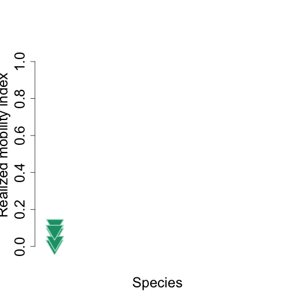

<!--
%\VignetteEngine{knitr::docco_classic}
%\VignetteIndexEntry{An Introduction to the animalmove package}
-->

Population Dispersion Index
=======================================


Load package library

```r
library(lubridate)
library(animalmove)
library(plyr)
library(ggplot2)
```


Subsample Data
------------

Buffalo dataset has been saved in the package data directory , and loaded on the package load.

Raw **buffalo** dataset contains unaltered original data.


```r

data(buffalo)
head(buffalo)
```

```
##   event.id visible               timestamp location.long location.lat
## 1 10210419    true 2005-02-17 05:05:00.000         31.77       -24.54
## 2 10210423    true 2005-02-17 05:05:00.000         31.77       -24.54
## 3 10210428    true 2005-02-17 06:08:00.000         31.76       -24.54
## 4 10210434    true 2005-02-17 06:08:00.000         31.76       -24.54
## 5 10210456    true 2005-02-17 07:05:00.000         31.76       -24.55
## 6 10210458    true 2005-02-17 08:05:00.000         31.76       -24.55
##   behavioural.classification comments manually.marked.outlier sensor.type
## 1                          0     24.3                      NA         gps
## 2                          0     24.3                      NA         gps
## 3                          0     29.5                      NA         gps
## 4                          0     29.5                      NA         gps
## 5                          0     35.8                      NA         gps
## 6                          0     37.3                      NA         gps
##   individual.taxon.canonical.name tag.local.identifier
## 1                 Syncerus caffer             #1764820
## 2                 Syncerus caffer             #1764820
## 3                 Syncerus caffer             #1764820
## 4                 Syncerus caffer             #1764820
## 5                 Syncerus caffer             #1764820
## 6                 Syncerus caffer             #1764820
##   individual.local.identifier
## 1                       Queen
## 2                       Queen
## 3                       Queen
## 4                       Queen
## 5                       Queen
## 6                       Queen
##                                           study.name utm.easting
## 1 Kruger African Buffalo, GPS tracking, South Africa      375051
## 2 Kruger African Buffalo, GPS tracking, South Africa      375051
## 3 Kruger African Buffalo, GPS tracking, South Africa      374851
## 4 Kruger African Buffalo, GPS tracking, South Africa      374851
## 5 Kruger African Buffalo, GPS tracking, South Africa      374527
## 6 Kruger African Buffalo, GPS tracking, South Africa      374492
##   utm.northing utm.zone             study.timezone   study.local.timestamp
## 1      7285726      36S South Africa Standard Time 2005-02-17 07:05:00.000
## 2      7285726      36S South Africa Standard Time 2005-02-17 07:05:00.000
## 3      7285502      36S South Africa Standard Time 2005-02-17 08:08:00.000
## 4      7285502      36S South Africa Standard Time 2005-02-17 08:08:00.000
## 5      7284538      36S South Africa Standard Time 2005-02-17 09:05:00.000
## 6      7284644      36S South Africa Standard Time 2005-02-17 10:05:00.000
```

```r

nrow(buffalo)
```

```
## [1] 28410
```

```r

currentnames <- colnames(buffalo)
currentnames
```

```
##  [1] "event.id"                        "visible"                        
##  [3] "timestamp"                       "location.long"                  
##  [5] "location.lat"                    "behavioural.classification"     
##  [7] "comments"                        "manually.marked.outlier"        
##  [9] "sensor.type"                     "individual.taxon.canonical.name"
## [11] "tag.local.identifier"            "individual.local.identifier"    
## [13] "study.name"                      "utm.easting"                    
## [15] "utm.northing"                    "utm.zone"                       
## [17] "study.timezone"                  "study.local.timestamp"
```

```r

names(buffalo)[names(buffalo) == "timestamp"] <- "time"
names(buffalo)[names(buffalo) == "utm.easting"] <- "x"
names(buffalo)[names(buffalo) == "utm.northing"] <- "y"
names(buffalo)[names(buffalo) == "tag.local.identifier"] <- "id"
names(buffalo)[names(buffalo) == "individual.taxon.canonical.name"] <- "pop.type"

# Data Conversion
buffalo$time <- as.POSIXct(strptime(buffalo$time, format = "%Y-%m-%d %H:%M", 
    tz = "GMT"))

# Display new names
newnames <- colnames(buffalo)
newnames
```

```
##  [1] "event.id"                    "visible"                    
##  [3] "time"                        "location.long"              
##  [5] "location.lat"                "behavioural.classification" 
##  [7] "comments"                    "manually.marked.outlier"    
##  [9] "sensor.type"                 "pop.type"                   
## [11] "id"                          "individual.local.identifier"
## [13] "study.name"                  "x"                          
## [15] "y"                           "utm.zone"                   
## [17] "study.timezone"              "study.local.timestamp"
```

```r
head(buffalo)
```

```
##   event.id visible                time location.long location.lat
## 1 10210419    true 2005-02-17 05:05:00         31.77       -24.54
## 2 10210423    true 2005-02-17 05:05:00         31.77       -24.54
## 3 10210428    true 2005-02-17 06:08:00         31.76       -24.54
## 4 10210434    true 2005-02-17 06:08:00         31.76       -24.54
## 5 10210456    true 2005-02-17 07:05:00         31.76       -24.55
## 6 10210458    true 2005-02-17 08:05:00         31.76       -24.55
##   behavioural.classification comments manually.marked.outlier sensor.type
## 1                          0     24.3                      NA         gps
## 2                          0     24.3                      NA         gps
## 3                          0     29.5                      NA         gps
## 4                          0     29.5                      NA         gps
## 5                          0     35.8                      NA         gps
## 6                          0     37.3                      NA         gps
##          pop.type       id individual.local.identifier
## 1 Syncerus caffer #1764820                       Queen
## 2 Syncerus caffer #1764820                       Queen
## 3 Syncerus caffer #1764820                       Queen
## 4 Syncerus caffer #1764820                       Queen
## 5 Syncerus caffer #1764820                       Queen
## 6 Syncerus caffer #1764820                       Queen
##                                           study.name      x       y
## 1 Kruger African Buffalo, GPS tracking, South Africa 375051 7285726
## 2 Kruger African Buffalo, GPS tracking, South Africa 375051 7285726
## 3 Kruger African Buffalo, GPS tracking, South Africa 374851 7285502
## 4 Kruger African Buffalo, GPS tracking, South Africa 374851 7285502
## 5 Kruger African Buffalo, GPS tracking, South Africa 374527 7284538
## 6 Kruger African Buffalo, GPS tracking, South Africa 374492 7284644
##   utm.zone             study.timezone   study.local.timestamp
## 1      36S South Africa Standard Time 2005-02-17 07:05:00.000
## 2      36S South Africa Standard Time 2005-02-17 07:05:00.000
## 3      36S South Africa Standard Time 2005-02-17 08:08:00.000
## 4      36S South Africa Standard Time 2005-02-17 08:08:00.000
## 5      36S South Africa Standard Time 2005-02-17 09:05:00.000
## 6      36S South Africa Standard Time 2005-02-17 10:05:00.000
```


Number of rows in the buffalo data & data set structure 

```r
length(table((buffalo$id)))
```

```
## [1] 6
```

```r

str(buffalo)
```

```
## 'data.frame':	28410 obs. of  18 variables:
##  $ event.id                   : int  10210419 10210423 10210428 10210434 10210456 10210458 10210483 10210535 10210544 10210558 ...
##  $ visible                    : chr  "true" "true" "true" "true" ...
##  $ time                       : POSIXct, format: "2005-02-17 05:05:00" "2005-02-17 05:05:00" ...
##  $ location.long              : num  31.8 31.8 31.8 31.8 31.8 ...
##  $ location.lat               : num  -24.5 -24.5 -24.5 -24.5 -24.5 ...
##  $ behavioural.classification : int  0 0 0 0 0 0 0 0 0 0 ...
##  $ comments                   : num  24.3 24.3 29.5 29.5 35.8 37.3 38.9 39.6 40 38.1 ...
##  $ manually.marked.outlier    : logi  NA NA NA NA NA NA ...
##  $ sensor.type                : chr  "gps" "gps" "gps" "gps" ...
##  $ pop.type                   : chr  "Syncerus caffer" "Syncerus caffer" "Syncerus caffer" "Syncerus caffer" ...
##  $ id                         : chr  "#1764820" "#1764820" "#1764820" "#1764820" ...
##  $ individual.local.identifier: chr  "Queen" "Queen" "Queen" "Queen" ...
##  $ study.name                 : chr  "Kruger African Buffalo, GPS tracking, South Africa" "Kruger African Buffalo, GPS tracking, South Africa" "Kruger African Buffalo, GPS tracking, South Africa" "Kruger African Buffalo, GPS tracking, South Africa" ...
##  $ x                          : num  375051 375051 374851 374851 374527 ...
##  $ y                          : num  7285726 7285726 7285502 7285502 7284538 ...
##  $ utm.zone                   : chr  "36S" "36S" "36S" "36S" ...
##  $ study.timezone             : chr  "South Africa Standard Time" "South Africa Standard Time" "South Africa Standard Time" "South Africa Standard Time" ...
##  $ study.local.timestamp      : chr  "2005-02-17 07:05:00.000" "2005-02-17 07:05:00.000" "2005-02-17 08:08:00.000" "2005-02-17 08:08:00.000" ...
```


### Subsample data within time interval
--------------------------------------

We select at most 6 individuals within 2009, time interval 50 hours, and accuracy 50 hours, and subsampling scheme for Realized Mobility Index

```r
pdi.subsample.data <- subsample(dat = buffalo, start = c("2005-02-17 00:00:00"), 
    end = "2006-12-31 00:00:00", interval = c("50 hours"), accuracy = c("3 hours"), 
    minIndiv = 3, maxIndiv = 6, mustIndiv = NULL, index.type = "pdi")
```

```
## [1] "50 hours"
## [1] "3 hours"
## [1] "2005-02-17 00:00:00"
## 'data.frame':	8 obs. of  9 variables:
##  $ numberOfIndividuals: int  3 4 5 6 5 5 4 3
##  $ pairsOfCompleteSets: int  32 19 8 7 9 18 37 49
##  $ completeSets       : int  34 21 10 9 10 20 39 52
##  $ scanInterval       : chr  "50 hours" "50 hours" "50 hours" "50 hours" ...
##  $ scanAccuracy       : chr  "3 hours" "3 hours" "3 hours" "3 hours" ...
##  $ firstScantime      : chr  "2005-02-17 00:00:00" "2005-02-17 00:00:00" "2005-02-17 00:00:00" "2005-02-17 00:00:00" ...
##  $ firstOverlap       : chr  "2005-07-27 10:00" "2005-08-23 12:00" "2005-09-15 10:00" "2005-09-17 12:00" ...
##  $ lastOverlap        : chr  "2005-10-06 06:00" "2005-10-06 06:00" "2005-10-06 06:00" "2005-10-06 06:00" ...
##  $ lastScantime       : chr  "2006-12-31 00:00:00" "2006-12-31 00:00:00" "2006-12-31 00:00:00" "2006-12-31 00:00:00" ...
```

```r

buffalo.indiv <- Individuals(pdi.subsample.data, id = "id", time = "time", x = "x", 
    y = "y", group.by = "pop.type", proj4string = CRS("+proj=utm +zone=28 +datum=WGS84"))
```


Analysis
----------------------------

## Display bounding box and scale for Specie1
---------------------------------------------


```r
bbox.coord1 <- bbox.coordinates(buffalo.indiv, percent = 100, unin = "m", unout = "km2")
bbox.coord1
```

```
##       min     max
## x  369957  394639
## y 7227424 7319263
```

```r

specie1.scale <- bbox.scale(buffalo.indiv, percent = 100, unin = "m", unout = "km2")
specie1.scale
```

```
##  [1]     0   617  1234  1851  2468  3085  3702  4319  4936  5553  6170
## [12]  6787  7404  8021  8639  9256  9873 10490 11107 11724 12341
```


## Specie1 polygon
---------------------------------------------

```r
specie1.poly <- mcp.population(buffalo.indiv, percent = 100)
specie1.poly
```

```
## Object of class "SpatialPolygonsDataFrame" (package sp):
## 
## Number of SpatialPolygons:  1
## 
## Variables measured:
##                              id   area
## Syncerus caffer Syncerus caffer 110025
```

```r

color = "green"

plot(specie1.poly, col = color, axes = TRUE)
points(buffalo.indiv, pch = 3)
title(main = "Syncerus caffer", xlab = "X", ylab = "Y")
```


## Compute PDI for each specie
----------------------------------


```r
pdi.index.specie1 <- pdi.index(buffalo.indiv, percent = 100, specie1.scale, 
    unin = "m", unout = "km2")
```


### Compute summaries of each specie PDI
-------------------------------------

```r
summary.specie1 <- summary.pdi(pdi.index.specie1)
summary.specie1
```

```
##    rowid        pop.type max.pdi min.pdi mean.pdi se.pdi scale
## 1      1 Syncerus caffer       0       0      0.0    0.0     0
## 2      2 Syncerus caffer     617   -2978  -1944.3  524.5   617
## 3      3 Syncerus caffer    1234   -3478  -1887.1  677.4  1234
## 4      4 Syncerus caffer    1851   -4054  -2030.9  864.9  1851
## 5      5 Syncerus caffer    2468   -5630  -2693.5 1214.8  2468
## 6      6 Syncerus caffer    3085   -6551  -2817.4 1449.5  3085
## 7      7 Syncerus caffer    3702   -6414  -2508.0 1520.7  3702
## 8      8 Syncerus caffer    4319   -6549  -2381.6 1622.4  4319
## 9      9 Syncerus caffer    4936   -6700  -2223.2 1720.5  4936
## 10    10 Syncerus caffer    5553   -6617  -2013.2 1803.9  5553
## 11    11 Syncerus caffer    6170   -6312  -1589.8 1857.6  6170
## 12    12 Syncerus caffer    6787   -5695  -1070.0 1847.0  6787
## 13    13 Syncerus caffer    7404   -5371   -667.6 1875.3  7404
## 14    14 Syncerus caffer    8021   -5902   -726.4 2082.6  8021
## 15    15 Syncerus caffer    8639   -5854   -418.3 2190.2  8639
## 16    16 Syncerus caffer    9256   -6238   -526.4 2436.5  9256
## 17    17 Syncerus caffer    6683   -6397   -984.9 2210.6  9873
## 18    18 Syncerus caffer    6558   -6678  -1111.3 2322.2 10490
## 19    19 Syncerus caffer    5925   -6157   -947.7 2152.1 11107
## 20    20 Syncerus caffer    4621   -5961  -1369.0 1895.2 11724
## 21    21 Syncerus caffer    3742   -5958  -1662.6 1779.1 12341
```


### Plot PDI
----------------------------------

```r
colorSpecie1 = "pink"
altColorSpecie1 = "red"

plot(pdi.index.specie1, col = colorSpecie1, linecol = altColorSpecie1, title = "Syncerus caffer")
```




### Extra Plotting
------------------------------------

```r
library(RColorBrewer)
g = 11
my.cols <- rev(brewer.pal(g, "RdYlBu"))
```


#### Smooth scatter 

```r
require(KernSmooth)
smoothScatter(pdi.subsample.data$location.long, pdi.subsample.data$location.lat, 
    nrpoints = 0.3 * 1e+05, colramp = colorRampPalette(my.cols), pch = 19, cex = 0.3, 
    col = "green1")
```


#### Kernel density using MASS 

```r
library(MASS)
z <- kde2d(pdi.subsample.data$location.long, pdi.subsample.data$location.lat, 
    n = 50)
plot(pdi.subsample.data$location.long, pdi.subsample.data$location.lat, xlab = "X", 
    ylab = "Y", pch = 19, cex = 0.3, col = "gray60")
contour(z, drawlabels = FALSE, nlevels = g, col = my.cols, add = TRUE, lwd = 2)
abline(h = mean(pdi.subsample.data$location.long), v = mean(pdi.subsample.data$location.lat), 
    lwd = 2, col = "black")
legend("topleft", paste("r=", round(cor(pdi.subsample.data$location.long, pdi.subsample.data$location.lat), 
    2)), bty = "n")
```


