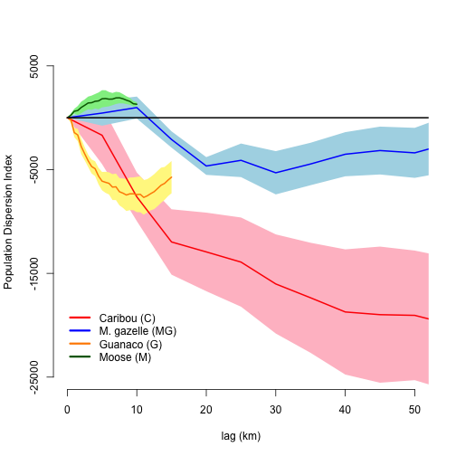

<!--
%\VignetteEngine{knitr::docco_classic}
%\VignetteIndexEntry{An Introduction to the animalmove package}
-->

Population Dispersion Index
=======================================

**[Khulan Data](#khulan-data)**

**[Original Article Data](#original)**

## <a name="#khulan-data"></a>Khulan Data
-------------------------------------------


Load package library

```r
library(animalmove)
```


Subsample Data
------------

Khulan dataset has been saved in the package data directory , and loaded on the package load.

Raw **khulan** dataset contains unlaltered original data.


```r
data(khulan.raw.data)
head(khulan.raw.data)
```

```
##   id    sex                time      X       Y   lat   lon age elevation
## 1  3 female 2009-07-20 12:47:00 498117 5026295 45.39 92.98 5-6      1361
## 2  3 female 2009-07-20 12:59:00 494908 5026062 45.39 92.93 5-6      1359
## 3  3 female 2009-07-20 13:12:00 493784 5026159 45.39 92.92 5-6      1357
## 4  3 female 2009-07-20 13:25:00 493014 5026142 45.39 92.91 5-6      1357
## 5  3 female 2009-07-20 13:38:00 492374 5026252 45.39 92.90 5-6      1353
## 6  3 female 2009-07-20 13:51:00 491814 5026458 45.39 92.90 5-6      1353
##   vegetation behaviour  unixTime
## 1          9           1.248e+09
## 2          9       TRA 1.248e+09
## 3          9       TRA 1.248e+09
## 4         10       TRA 1.248e+09
## 5          6       TRA 1.248e+09
## 6          9       TRA 1.248e+09
```


Number of rows in the khulan.raw.data

```r
nrow(khulan.raw.data)
```

```
## [1] 222632
```


For demonstration purposes we add a column that indicates a specie type to the data frame for each relocation data.

Enhanced dataset has been saved into khulan.test.data a column pop.type, which indicates a specie type.

Specie type assignment rule:  Individuals with ids 3,4,7, 6441 assigned to the specie1 type, and the rest is identified as specie2 type.


```r
data(khulan.test.data)
head(khulan.test.data)
```

```
##    id    sex                time      X       Y   lat   lon age elevation
## 1:  3 female 2009-07-20 12:47:00 498117 5026295 45.39 92.98 5-6      1361
## 2:  3 female 2009-07-20 12:59:00 494908 5026062 45.39 92.93 5-6      1359
## 3:  3 female 2009-07-20 13:12:00 493784 5026159 45.39 92.92 5-6      1357
## 4:  3 female 2009-07-20 13:25:00 493014 5026142 45.39 92.91 5-6      1357
## 5:  3 female 2009-07-20 13:38:00 492374 5026252 45.39 92.90 5-6      1353
## 6:  3 female 2009-07-20 13:51:00 491814 5026458 45.39 92.90 5-6      1353
##    vegetation behaviour  unixTime pop.type
## 1:          9           1.248e+09 species1
## 2:          9       TRA 1.248e+09 species1
## 3:          9       TRA 1.248e+09 species1
## 4:         10       TRA 1.248e+09 species1
## 5:          6       TRA 1.248e+09 species1
## 6:          9       TRA 1.248e+09 species1
```


Number of rows in the khulan.test.data


```r
nrow(khulan.test.data)
```

```
## [1] 222632
```


### Subsample data within time interval
--------------------------------------

We select at most 6 individuals within 2009, time interval 50 hours, and accuracy 50 hours, and subsampling scheme for Realized Mobility Index

```r
pdi.data <- subsample(khulan.test.data, start = c("2009-01-01 00:00"), end = "2009-12-31 00:00", 
    interval = c("50 hours"), accuracy = c("3 mins"), minIndiv = 3, maxIndiv = 6, 
    mustIndiv = NULL, index.type = "pdi")

head(pdi.data)
```

```
##   overlapID           scantimes   id    sex                time      X
## 1       100 2009-07-26 06:00:00    3 female 2009-07-26 06:00:00 481551
## 2       100 2009-07-26 06:00:00 6441   male 2009-07-26 06:00:00 546746
## 3       100 2009-07-26 06:00:00 6446 female 2009-07-26 06:00:00 506485
## 4       100 2009-07-26 06:00:00 7376 female 2009-07-26 06:00:00 508983
## 5       102 2009-07-30 10:00:00    3 female 2009-07-30 09:57:00 480753
## 6       102 2009-07-30 10:00:00 6441   male 2009-07-30 10:00:00 545652
##         Y   lat   lon age elevation vegetation behaviour  unixTime
## 1 5023605 45.37 92.76 5-6      1373          9       GRA 1.249e+09
## 2 5014428 45.28 93.60  15      1591          9       GRA 1.249e+09
## 3 5040413 45.52 93.08  15      1536          6       RST 1.249e+09
## 4 5011316 45.26 93.11 2-3      1560         10       TRA 1.249e+09
## 5 5030332 45.43 92.75 5-6      1300          9       TRA 1.249e+09
## 6 5013327 45.27 93.58  15      1608          9       GRA 1.249e+09
##   pop.type   time.lag
## 1 species1 2.083 days
## 2 species1 2.083 days
## 3 species2 2.083 days
## 4 species2 2.083 days
## 5 species1 6.248 days
## 6 species1 6.250 days
```


Note, a number of rows in the pdi subsample dataset


```r
nrow(pdi.data)
```

```
## [1] 144
```


### Prepare data for the analysis in the spatial form
----------------------------

Create attribute data frame


```r
dt.pdi.data <- data.table(pdi.data)

dt.pdi.data.attr <- dt.pdi.data[, list(id = id, pop.type = pop.type, x = X, 
    y = Y, time = time, time.lag = time.lag, age = age, elevation = elevation, 
    behaviour = behaviour)]
str(dt.pdi.data.attr)
```

```
## Classes 'data.table' and 'data.frame':	144 obs. of  9 variables:
##  $ id       : int  3 6441 6446 7376 3 6441 6446 7376 3 6441 ...
##  $ pop.type : chr  "species1" "species1" "species2" "species2" ...
##  $ x        : num  481551 546746 506485 508983 480753 ...
##  $ y        : num  5023605 5014428 5040413 5011316 5030332 ...
##  $ time     : POSIXct, format: "2009-07-26 06:00:00" "2009-07-26 06:00:00" ...
##  $ time.lag :Class 'difftime'  atomic [1:144] 2.08 2.08 2.08 2.08 6.25 ...
##   .. ..- attr(*, "tzone")= chr "GMT"
##   .. ..- attr(*, "units")= chr "days"
##  $ age      : Factor w/ 5 levels "12","15","2-3",..: 5 2 2 3 5 2 2 3 5 2 ...
##  $ elevation: int  1373 1591 1536 1560 1300 1608 1448 1531 1329 1596 ...
##  $ behaviour: Factor w/ 4 levels "","GRA","RST",..: 2 2 3 4 4 2 2 2 2 3 ...
##  - attr(*, ".internal.selfref")=<externalptr>
```


Subset species1 & species2

```r
# Subset species 1
dt.pdi.data.species1 <- dt.pdi.data.attr[pop.type == "species1"]

# Subset species 2
dt.pdi.data.species2 <- dt.pdi.data.attr[pop.type == "species2"]
```


Create spatial coordinates

```r
dt.pdi.data.specie1.xy <- dt.pdi.data.species1[, list(x, y)]

# Create spatial coordinates - Specie2
dt.pdi.data.specie2.xy <- dt.pdi.data.species2[, list(x, y)]
```


Create spatial points

```r
xy.sp.pdi.data.specie1 <- SpatialPoints(dt.pdi.data.specie1.xy)
xy.sp.pdi.data.specie2 <- SpatialPoints(dt.pdi.data.specie2.xy)
```


Create spatial points data frame with attributes

```r
xy.pdi.data.spdf.specie1 <- SpatialPointsDataFrame(xy.sp.pdi.data.specie1, dt.pdi.data.species1)
xy.pdi.data.spdf.specie2 <- SpatialPointsDataFrame(xy.sp.pdi.data.specie2, dt.pdi.data.species2)
```


Create Individuals data.frame - relocations of khulan data

```r
khulan.reloc.specie1.spatial <- Individuals(xy.pdi.data.spdf.specie1, group.by = "pop.type")
khulan.reloc.specie2.spatial <- Individuals(xy.pdi.data.spdf.specie2, group.by = "pop.type")
head(khulan.reloc.specie1.spatial)
```

```
##         coordinates   id pop.type      x       y                time
## 1 (481551, 5023610)    3 species1 481551 5023605 2009-07-26 06:00:00
## 2 (546746, 5014430) 6441 species1 546746 5014428 2009-07-26 06:00:00
## 3 (480753, 5030330)    3 species1 480753 5030332 2009-07-30 09:57:00
## 4 (545652, 5013330) 6441 species1 545652 5013327 2009-07-30 10:00:00
## 5 (493299, 5029430)    3 species1 493299 5029428 2009-08-01 11:59:00
## 6 (544104, 5014270) 6441 species1 544104 5014269 2009-08-01 12:00:00
##     time.lag age elevation behaviour
## 1 2.083 days 5-6      1373       GRA
## 2 2.083 days  15      1591       GRA
## 3 6.248 days 5-6      1300       TRA
## 4 6.250 days  15      1608       GRA
## 5 8.333 days 5-6      1329       GRA
## 6 8.333 days  15      1596       RST
## Coordinate Reference System (CRS) arguments: NA
```

```r
head(khulan.reloc.specie2.spatial)
```

```
##         coordinates   id pop.type      x       y                time
## 1 (506485, 5040410) 6446 species2 506485 5040413 2009-07-26 06:00:00
## 2 (508983, 5011320) 7376 species2 508983 5011316 2009-07-26 06:00:00
## 3 (509530, 5037730) 6446 species2 509530 5037727 2009-07-30 10:00:00
## 4 (463955, 4990690) 7376 species2 463955 4990692 2009-07-30 10:00:00
## 5 (520495, 5035010) 6446 species2 520495 5035012 2009-08-01 12:00:00
## 6 (462484, 4992390) 7376 species2 462484 4992394 2009-08-01 12:00:00
##     time.lag age elevation behaviour
## 1 2.083 days  15      1536       RST
## 2 2.083 days 2-3      1560       TRA
## 3 6.250 days  15      1448       GRA
## 4 6.250 days 2-3      1531       GRA
## 5 8.333 days  15      1470       RST
## 6 8.333 days 2-3      1721       RST
## Coordinate Reference System (CRS) arguments: NA
```


Analysis
----------------------------

## Display bounding box and scale for Specie1
---------------------------------------------


```r
bbox.coord1 <- bbox.coordinates(khulan.reloc.specie1.spatial, percent = 100, 
    unin = "m", unout = "km2")
bbox.coord1
```

```
##       min     max
## x  387773  546788
## y 4994228 5043207
```

```r

specie1.scale <- bbox.scale(khulan.reloc.specie1.spatial, percent = 100, unin = "m", 
    unout = "km2")
specie1.scale
```

```
##  [1]     0  1224  2449  3673  4898  6122  7347  8571  9796 11020 12245
## [12] 13469 14693 15918 17142 18367 19591 20816 22040 23265 24489
```


## Specie1 polygon
---------------------------------------------

```r
specie1.poly <- mcp.population(khulan.reloc.specie1.spatial, percent = 100)

color = "green"

plot(specie1.poly, col = color, axes = TRUE)
points(khulan.reloc.specie1.spatial, pch = 3)
title(main = "Specie1", xlab = "X", ylab = "Y")
```


## Display bounding box and scale for Specie2
---------------------------------------------


```r
bbox.coord2 <- bbox.coordinates(khulan.reloc.specie2.spatial, percent = 100, 
    unin = "m", unout = "km2")
bbox.coord2
```

```
##       min     max
## x  377094  543050
## y 4990393 5043350
```

```r

specie2.scale <- bbox.scale(khulan.reloc.specie2.spatial, percent = 100, unin = "m", 
    unout = "km2")
specie2.scale
```

```
##  [1]     0  1324  2648  3972  5296  6620  7944  9267 10591 11915 13239
## [12] 14563 15887 17211 18535 19859 21183 22507 23831 25154 26478
```


## Specie2 polygon
---------------------------------------------

```r
specie2.poly <- mcp.population(khulan.reloc.specie2.spatial, percent = 100)

plot(specie2.poly, col = color, axes = TRUE)
points(khulan.reloc.specie1.spatial, pch = 3)
title(main = "Specie2", xlab = "X", ylab = "Y")
```


## Compute PDI for each specie
----------------------------------


```r
pdi.index.specie1 <- pdi.index(khulan.reloc.specie1.spatial, percent = 100, 
    specie1.scale, unin = "m", unout = "km2")
pdi.index.specie2 <- pdi.index(khulan.reloc.specie2.spatial, percent = 100, 
    specie2.scale, unin = "m", unout = "km2")
```


### Compute summaries of each specie PDI
-------------------------------------

```r
summary.specie1 <- summary.pdi(pdi.index.specie1)
summary.specie1
```

```
##    rowid pop.type max.pdi min.pdi mean.pdi se.pdi scale
## 1      1 species1     0.0     0.0      0.0      0     0
## 2      2 species1 -1360.4 -1360.4  -1360.4      0  1224
## 3      3 species1 -2028.2 -2028.2  -2028.2      0  2449
## 4      4 species1 -1809.9 -1809.9  -1809.9      0  3673
## 5      5 species1  -882.1  -882.1   -882.1      0  4898
## 6      6 species1 -1372.1 -1372.1  -1372.1      0  6122
## 7      7 species1 -1075.5 -1075.5  -1075.5      0  7347
## 8      8 species1  -841.1  -841.1   -841.1      0  8571
## 9      9 species1  -983.2  -983.2   -983.2      0  9796
## 10    10 species1 -1724.2 -1724.2  -1724.2      0 11020
## 11    11 species1 -2548.0 -2548.0  -2548.0      0 12245
## 12    12 species1 -2111.0 -2111.0  -2111.0      0 13469
## 13    13 species1 -3230.1 -3230.1  -3230.1      0 14693
## 14    14 species1 -3364.4 -3364.4  -3364.4      0 15918
## 15    15 species1 -3661.6 -3661.6  -3661.6      0 17142
## 16    16 species1 -3963.9 -3963.9  -3963.9      0 18367
## 17    17 species1 -3822.2 -3822.2  -3822.2      0 19591
## 18    18 species1 -3641.3 -3641.3  -3641.3      0 20816
## 19    19 species1 -3692.0 -3692.0  -3692.0      0 22040
## 20    20 species1 -3799.4 -3799.4  -3799.4      0 23265
## 21    21 species1 -3886.3 -3886.3  -3886.3      0 24489
```

```r

summary.specie2 <- summary.pdi(pdi.index.specie2)
summary.specie2
```

```
##    rowid pop.type max.pdi min.pdi mean.pdi se.pdi scale
## 1      1 species2    0.00    0.00     0.00      0     0
## 2      2 species2   86.93   86.93    86.93      0  1324
## 3      3 species2  173.85  173.85   173.85      0  2648
## 4      4 species2  698.98  698.98   698.98      0  3972
## 5      5 species2 1183.90 1183.90  1183.90      0  5296
## 6      6 species2 1649.57 1649.57  1649.57      0  6620
## 7      7 species2 1168.68 1168.68  1168.68      0  7944
## 8      8 species2 1624.99 1624.99  1624.99      0  9267
## 9      9 species2 1744.04 1744.04  1744.04      0 10591
## 10    10 species2 2561.08 2561.08  2561.08      0 11915
## 11    11 species2 3018.50 3018.50  3018.50      0 13239
## 12    12 species2 3959.42 3959.42  3959.42      0 14563
## 13    13 species2 4496.05 4496.05  4496.05      0 15887
## 14    14 species2 4884.79 4884.79  4884.79      0 17211
## 15    15 species2 5502.02 5502.02  5502.02      0 18535
## 16    16 species2 5578.62 5578.62  5578.62      0 19859
## 17    17 species2 5728.66 5728.66  5728.66      0 21183
## 18    18 species2 5254.80 5254.80  5254.80      0 22507
## 19    19 species2 4885.35 4885.35  4885.35      0 23831
## 20    20 species2 4755.62 4755.62  4755.62      0 25154
## 21    21 species2 5175.57 5175.57  5175.57      0 26478
```


### Plot PDI
----------------------------------

```r
colorSpecie1 = "pink"
altColorSpecie1 = "red"

colorSpecie2 = "lightblue"
altColorSpecie2 = "blue"

plot(pdi.index.specie1, col = colorSpecie1, linecol = altColorSpecie1, title = "Spatial Population Dispersion - Specie1, Kilometers")
```


```r
plot(pdi.index.specie2, col = colorSpecie2, linecol = altColorSpecie2, title = "Spatial Population Dispersion - Specie2, Kilometers")
```


## <a name="#original"></a>Original Article Data
------------------------------------------------

### Load Caribou, Gazelle, Moose, Guanaco data
-----------------------------------------------

```r
data(caribou.reloc.16day.5indiv)
data(gazelle.reloc.16day.5indiv)
data(moose.reloc.16day.5indiv)
data(guanaco.reloc.16day.5indiv)
```


### Load Caribou, Gazelle, Moose, Guanaco data
-----------------------------------------------

```r
caribou.scale = seq(0, 1e+05, 5000)
gazelle.scale = caribou.scale
moose.scale = seq(0, 10000, 500)
guanaco.scale = seq(0, 15000, 500)
```


### Compute PDI for each specie
-----------------------------------------------

```r
pdi.index.caribou <- pdi.index(caribou.reloc.16day.5indiv, percent = 100, caribou.scale, 
    unin = "m", unout = "km2")
pdi.index.gazelle <- pdi.index(gazelle.reloc.16day.5indiv, percent = 100, gazelle.scale, 
    unin = "m", unout = "km2")
pdi.index.guanaco <- pdi.index(guanaco.reloc.16day.5indiv, percent = 100, guanaco.scale, 
    unin = "m", unout = "km2")
pdi.index.moose <- pdi.index(moose.reloc.16day.5indiv, percent = 100, moose.scale, 
    unin = "m", unout = "km2")
```

### Compute summaries of each specie PDI
-----------------------------------------------

```r
summary.caribou <- summary.pdi(pdi.index.caribou)
summary.gazelle <- summary.pdi(pdi.index.gazelle)
summary.guanaco <- summary.pdi(pdi.index.guanaco)
summary.moose <- summary.pdi(pdi.index.moose)
```


### PDI Index Summaries
------------------------------------------------

#### Caribou PDI Summary
------------------------------------------------

```r
summary.caribou
```

```
##    rowid pop.type max.pdi min.pdi mean.pdi se.pdi  scale
## 1      1  caribou     0.0       0        0      0      0
## 2      2  caribou  5000.0   -8050    -1687   2779   5000
## 3      3  caribou -2076.1  -13645    -7620   2337  10000
## 4      4  caribou -4964.1  -19141   -11974   3151  15000
## 5      5  caribou -1935.4  -21003   -12932   3785  20000
## 6      6  caribou -2901.3  -23581   -13914   4297  25000
## 7      7  caribou -4143.6  -26083   -16021   4776  30000
## 8      8  caribou -4325.4  -28574   -17352   5302  35000
## 9      9  caribou -3548.7  -31364   -18721   6032  40000
## 10    10  caribou -2552.3  -32152   -18981   6561  45000
## 11    11  caribou -2170.8  -31076   -19048   6244  50000
## 12    12  caribou  -473.3  -32114   -19897   6410  55000
## 13    13  caribou  2032.1  -30519   -18211   6474  60000
## 14    14  caribou  2995.6  -28748   -17087   6160  65000
## 15    15  caribou  4144.0  -27355   -15840   6148  70000
## 16    16  caribou  5701.3  -23910   -13217   5872  75000
## 17    17  caribou  9197.9  -21782   -10758   5997  80000
## 18    18  caribou 11686.9  -18569    -8083   5758  85000
## 19    19  caribou 14084.0  -17980    -6743   5812  90000
## 20    20  caribou 16829.2  -15805    -4934   5864  95000
## 21    21  caribou 18985.6  -13956    -2621   5785 100000
```

#### Gazelle PDI Summary
------------------------------------------------

```r
summary.gazelle
```

```
##    rowid pop.type max.pdi min.pdi mean.pdi se.pdi  scale
## 1      1  gazelle     0.0       0      0.0    0.0      0
## 2      2  gazelle  5000.0   -2292    447.7 1210.9   5000
## 3      3  gazelle  3684.7   -1284    980.3 1059.6  10000
## 4      4  gazelle  -281.3   -4452  -2096.2  783.1  15000
## 5      5  gazelle -2470.9   -7706  -4651.4  854.1  20000
## 6      6  gazelle  -256.4   -9679  -4104.6 1617.7  25000
## 7      7  gazelle  -751.7  -12179  -5305.0 2084.3  30000
## 8      8  gazelle  -595.5  -11605  -4458.2 2045.0  35000
## 9      9  gazelle  1122.8  -10776  -3517.3 2126.6  40000
## 10    10  gazelle  3272.7   -9835  -3161.6 2306.2  45000
## 11    11  gazelle  3269.0  -10091  -3384.0 2409.8  50000
## 12    12  gazelle  5402.1   -9819  -2464.7 2714.6  55000
## 13    13  gazelle  7709.3   -9712  -1014.2 3062.3  60000
## 14    14  gazelle  5236.6   -9359  -1784.1 2842.2  65000
## 15    15  gazelle  6850.8   -7725   -425.4 2890.4  70000
## 16    16  gazelle  8435.5   -6859   -650.7 2922.9  75000
## 17    17  gazelle  8683.4   -7610  -1126.9 2911.0  80000
## 18    18  gazelle  8757.4   -7219   -899.8 2839.9  85000
## 19    19  gazelle 11160.7   -8516  -1285.9 3434.8  90000
## 20    20  gazelle 10693.7   -7617  -2055.5 3288.5  95000
## 21    21  gazelle 10792.1   -7148  -2200.6 3316.0 100000
```


#### Guanaco PDI Summary
------------------------------------------------

```r
summary.guanaco
```

```
##    rowid pop.type  max.pdi min.pdi mean.pdi se.pdi scale
## 1      1  guanaco     0.00       0      0.0    0.0     0
## 2      2  guanaco   500.00   -1043   -117.4  378.1   500
## 3      3  guanaco  -543.43   -2781  -1427.4  441.0  1000
## 4      4  guanaco   -43.43   -3130  -1661.8  599.5  1500
## 5      5  guanaco  -182.75   -4496  -2767.6  738.5  2000
## 6      6  guanaco -1280.63   -4692  -3476.4  628.7  2500
## 7      7  guanaco -2346.61   -5593  -4152.4  589.1  3000
## 8      8  guanaco -3151.52   -6383  -4700.7  676.3  3500
## 9      9  guanaco -3168.63   -6581  -4912.1  714.8  4000
## 10    10  guanaco -2832.90   -7355  -5634.6  795.6  4500
## 11    11  guanaco -2805.00   -7918  -6110.9  883.9  5000
## 12    12  guanaco -2305.00   -7959  -6222.4 1014.8  5500
## 13    13  guanaco -2126.72   -7841  -6325.1 1067.9  6000
## 14    14  guanaco -1775.26   -8310  -6684.5 1245.2  6500
## 15    15  guanaco -1601.14   -8307  -6657.8 1280.2  7000
## 16    16  guanaco -1957.78   -9057  -7131.1 1313.7  7500
## 17    17  guanaco -1754.82   -9520  -7267.9 1415.7  8000
## 18    18  guanaco -1399.58   -9955  -7446.7 1542.6  8500
## 19    19  guanaco -1196.24  -10072  -7334.7 1571.8  9000
## 20    20  guanaco -1132.43   -9861  -7332.1 1580.6  9500
## 21    21  guanaco  -763.26  -10373  -7399.2 1700.2 10000
## 22    22  guanaco  -725.86  -10670  -7381.9 1725.6 10500
## 23    23  guanaco -1399.80  -11339  -7678.9 1670.6 11000
## 24    24  guanaco -1480.27  -11064  -7528.8 1605.4 11500
## 25    25  guanaco -1317.26  -11042  -7316.0 1609.9 12000
## 26    26  guanaco  -817.26  -10929  -7125.7 1683.4 12500
## 27    27  guanaco  -449.05  -10730  -6818.1 1702.4 13000
## 28    28  guanaco  -134.53  -10352  -6502.6 1695.5 13500
## 29    29  guanaco  -392.56   -9959  -6329.7 1584.4 14000
## 30    30  guanaco  -246.35   -9588  -6008.6 1543.1 14500
## 31    31  guanaco   140.25   -9161  -5725.3 1553.7 15000
```


#### Moose PDI Summary
------------------------------------------------

```r
summary.moose
```

```
##    rowid pop.type max.pdi min.pdi mean.pdi se.pdi scale
## 1      1    moose       0    0.00      0.0    0.0     0
## 2      2    moose     500 -174.87    236.4  161.5   500
## 3      3    moose    1000   58.53    625.5  229.3  1000
## 4      4    moose    1500 -419.92    694.2  434.6  1500
## 5      5    moose    2000 -457.51    990.6  558.8  2000
## 6      6    moose    2192 -240.87   1199.2  563.6  2500
## 7      7    moose    2564  -94.57   1423.0  615.0  3000
## 8      8    moose    2702 -272.19   1448.6  688.0  3500
## 9      9    moose    2912 -170.10   1585.1  700.9  4000
## 10    10    moose    3153 -420.83   1624.1  810.9  4500
## 11    11    moose    3434 -226.30   1827.0  828.6  5000
## 12    12    moose    3395 -106.99   1850.4  798.8  5500
## 13    13    moose    3005   45.75   1790.2  690.9  6000
## 14    14    moose    2951  269.49   1800.0  588.0  6500
## 15    15    moose    2974  344.11   1911.9  586.2  7000
## 16    16    moose    2944  523.03   1923.5  534.0  7500
## 17    17    moose    2704  580.21   1831.9  448.0  8000
## 18    18    moose    2437  637.86   1695.1  377.7  8500
## 19    19    moose    2319  511.90   1577.5  333.0  9000
## 20    20    moose    2166  517.73   1346.2  266.8  9500
## 21    21    moose    1958  846.38   1303.2  193.7 10000
```


### Plot polygons
------------------------------------------------

```r
par(mfrow = c(2, 2), oma = c(0, 0, 2, 0))
```


#### Caribou polygon
------------------------------------------------

```r
caribou.poly <- mcp.population(caribou.reloc.16day.5indiv, percent = 100, unin = "m", 
    unout = "km2")
caribou.poly
```

```
## Object of class "SpatialPolygonsDataFrame" (package sp):
## 
## Number of SpatialPolygons:  1
## 
## Variables measured:
##              id   area
## caribou caribou 107685
```

```r

caribou.poly
```

```
## Object of class "SpatialPolygonsDataFrame" (package sp):
## 
## Number of SpatialPolygons:  1
## 
## Variables measured:
##              id   area
## caribou caribou 107685
```

```r
head(caribou.poly)
```

```
## Object of class "SpatialPolygonsDataFrame" (package sp):
## 
## Number of SpatialPolygons:  1
## 
## Variables measured:
##              id
## caribou caribou
```

```r

plot(caribou.poly, col = color, axes = TRUE)
points(caribou.reloc.16day.5indiv, pch = 3)
title(main = "Caribou", xlab = "X", ylab = "Y")
```


#### Caribou area
------------------------------------------------

```r
caribou.area <- mcp.area.population(caribou.reloc.16day.5indiv, percent = 100, 
    plotit = FALSE)
caribou.area
```

```
##      caribou
## 100 10768516
```


#### Gazelle polygon
------------------------------------------------

```r
gazelle.poly <- mcp.population(gazelle.reloc.16day.5indiv, percent = 100, unin = "m", 
    unout = "km2")
gazelle.poly
```

```
## Object of class "SpatialPolygonsDataFrame" (package sp):
## 
## Number of SpatialPolygons:  1
## 
## Variables measured:
##              id  area
## gazelle gazelle 44772
```

```r

gazelle.poly
```

```
## Object of class "SpatialPolygonsDataFrame" (package sp):
## 
## Number of SpatialPolygons:  1
## 
## Variables measured:
##              id  area
## gazelle gazelle 44772
```

```r
head(gazelle.poly)
```

```
## Object of class "SpatialPolygonsDataFrame" (package sp):
## 
## Number of SpatialPolygons:  1
## 
## Variables measured:
##              id
## gazelle gazelle
```

```r

plot(gazelle.poly, col = color, axes = TRUE)
points(gazelle.reloc.16day.5indiv, pch = 3)
title(main = "Gazelle", xlab = "X", ylab = "Y")
```


#### Gazelle area
------------------------------------------------

```r
gazelle.area <- mcp.area.population(gazelle.reloc.16day.5indiv, percent = 100, 
    plotit = FALSE)
gazelle.area
```

```
##     gazelle
## 100 4477248
```


#### Moose polygon
------------------------------------------------

```r
moose.poly <- mcp.population(moose.reloc.16day.5indiv, percent = 100, unin = "m", 
    unout = "km2")
moose.poly
```

```
## Object of class "SpatialPolygonsDataFrame" (package sp):
## 
## Number of SpatialPolygons:  1
## 
## Variables measured:
##          id area
## moose moose  282
```

```r

moose.poly
```

```
## Object of class "SpatialPolygonsDataFrame" (package sp):
## 
## Number of SpatialPolygons:  1
## 
## Variables measured:
##          id area
## moose moose  282
```

```r
head(moose.poly)
```

```
## Object of class "SpatialPolygonsDataFrame" (package sp):
## 
## Number of SpatialPolygons:  1
## 
## Variables measured:
##          id
## moose moose
```

```r

plot(moose.poly, col = color, axes = TRUE)
points(moose.reloc.16day.5indiv, pch = 3)
title(main = "Moose", xlab = "X", ylab = "Y")
```


#### Moose area
------------------------------------------------

```r
moose.area <- mcp.area.population(moose.reloc.16day.5indiv, percent = 100, plotit = FALSE)
moose.area
```

```
##     moose
## 100 28201
```


#### Guanaco polygon
------------------------------------------------

```r
guanaco.poly <- mcp.population(guanaco.reloc.16day.5indiv, percent = 100, unin = "m", 
    unout = "km2")
guanaco.poly
```

```
## Object of class "SpatialPolygonsDataFrame" (package sp):
## 
## Number of SpatialPolygons:  1
## 
## Variables measured:
##              id area
## guanaco guanaco 1624
```

```r

guanaco.poly
```

```
## Object of class "SpatialPolygonsDataFrame" (package sp):
## 
## Number of SpatialPolygons:  1
## 
## Variables measured:
##              id area
## guanaco guanaco 1624
```

```r
head(guanaco.poly)
```

```
## Object of class "SpatialPolygonsDataFrame" (package sp):
## 
## Number of SpatialPolygons:  1
## 
## Variables measured:
##              id
## guanaco guanaco
```

```r

plot(guanaco.poly, col = color, axes = TRUE)
points(guanaco.reloc.16day.5indiv, pch = 3)
title(main = "Guanaco", xlab = "X", ylab = "Y")
```


#### Guanaco area
------------------------------------------------

```r
guanaco.area <- mcp.area.population(guanaco.reloc.16day.5indiv, percent = 100, 
    plotit = FALSE)
guanaco.area
```

```
##     guanaco
## 100  162400
```


### Plot PDI

```r
# Create X and Y axes for each species

# caribou
caribou.X <- c(summary.caribou$scale, rev(summary.caribou$scale))
caribou.Y <- c(summary.caribou$mean.pdi + summary.caribou$se.pdi, rev(summary.caribou$mean.pdi - 
    summary.caribou$se.pdi))

# gazelle
gazelle.X <- c(summary.gazelle$scale, rev(summary.gazelle$scale))
gazelle.Y <- c(summary.gazelle$mean.pdi + summary.gazelle$se.pdi, rev(summary.gazelle$mean.pdi - 
    summary.gazelle$se.pdi))

# guanaco
guanaco.X <- c(summary.guanaco$scale, rev(summary.guanaco$scale))
guanaco.Y <- c(summary.guanaco$mean.pdi + summary.guanaco$se.pdi, rev(summary.guanaco$mean.pdi - 
    summary.guanaco$se.pdi))

# moose
moose.X <- c(summary.moose$scale, rev(summary.moose$scale))
moose.Y <- c(summary.moose$mean.pdi + summary.moose$se.pdi, rev(summary.moose$mean.pdi - 
    summary.moose$se.pdi))


# Plot default settings

colorCaribou = "pink"
colorGazelle = "lightblue"
colorGuanaco = "khaki1"  #'#FFFF99'
colorMoose = "lightgreen"
colorCaribou2 = "red"
colorGazelle2 = "blue"
colorGuanaco2 = "darkorange"
colorMoose2 = "darkgreen"

cexValue = 2

cexValue = 1

# Change number of panels in the plotting window back to a single panel
par(mfrow = c(1, 1))

# Change margin size par(mar = c(5, 5, 2, 1))

# Create empty plot, with axes labels
plot(caribou.scale, summary.gazelle$mean.pdi, ylim = c(-25000, 5000), xlim = c(0, 
    50000), col = NA, ylab = "Population Dispersion Index", xlab = "lag (km)", 
    cex.lab = cexValue, cex.axis = cexValue, cex = cexValue, axes = F)

# Add caribou data
polygon(caribou.X, caribou.Y, col = colorCaribou, border = NA)  # plots CI's

# Add gazelle data
polygon(gazelle.X, gazelle.Y, col = colorGazelle, border = NA)  # plots CI's

# Add Moose data
polygon(moose.X, moose.Y, col = colorMoose, border = NA)  # plots CI's

# Add guanaco data
polygon(guanaco.X, guanaco.Y, col = colorGuanaco, border = NA)  # plots CI's


# Add lines
lines(summary.caribou$scale, summary.caribou$mean.pdi, col = colorCaribou2, 
    lwd = 2)  # plots PDI
lines(summary.gazelle$scale, summary.gazelle$mean.pdi, col = colorGazelle2, 
    lwd = 2)  # plots PDI
lines(summary.moose$scale, summary.moose$mean.pdi, col = colorMoose2, lwd = 2)  # plots PDI
lines(summary.guanaco$scale, summary.guanaco$mean.pdi, col = colorGuanaco2, 
    lwd = 2)  # plots PDI


lines(c(0, 1e+05), c(0, 0), lwd = 2, lty = 1)  # add baseline

# Add axes
axis(1, at = seq(0, 50000, 10000), labels = seq(0, 50, 10), cex.axis = cexValue)
axis(2, at = seq(-25000, 5000, 10000), cex.axis = cexValue)

# Add legend
legend(-1000, -18000, legend = c("Caribou (C)", "M. gazelle (MG)", "Guanaco (G)", 
    "Moose (M)"), col = c(colorCaribou2, colorGazelle2, colorGuanaco2, colorMoose2), 
    box.lty = 0, lty = 1, lwd = 3, cex = cexValue, bg = NA)
```



```r

plot(pdi.index.caribou, col = colorCaribou, linecol = colorCaribou2, title = "Spatial Population Dispersion - Caribou, Kilometers")
```


```r
plot(pdi.index.gazelle, col = colorGazelle, linecol = colorGazelle2, title = "Spatial Population Dispersion - Gazelle, Kilometers")
```


```r
plot(pdi.index.moose, col = colorMoose, linecol = colorMoose2, title = "Spatial Population Dispersion - Moose, Kilometers")
```


```r
plot(pdi.index.guanaco, col = colorGuanaco, linecol = colorGuanaco2, title = "Spatial Population Dispersion - Guanaco, Kilometers")
```


