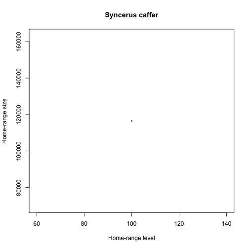
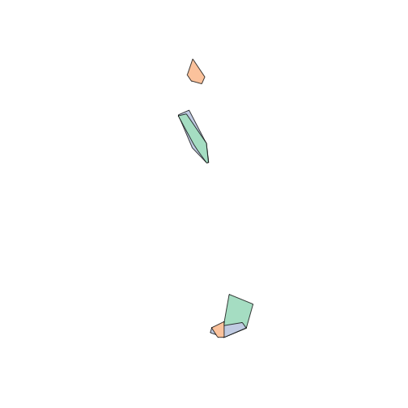
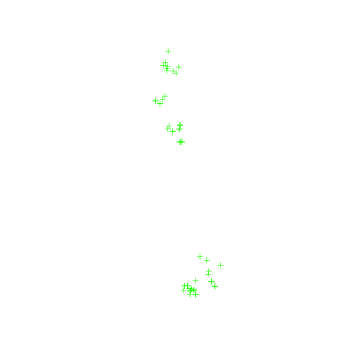
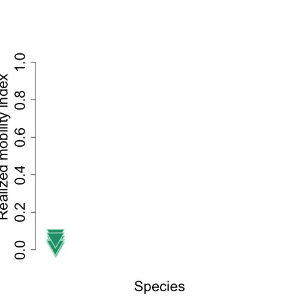

<!--
%\VignetteEngine{knitr::docco_classic}
%\VignetteIndexEntry{An Introduction to the animalmove package}
-->

Realized Mobility Index
=======================================


Load package library

```r
library(lubridate)
library(animalmove)
library(plyr)
```


Subsample Data
------------

Buffalo dataset has been saved in the package data directory , and loaded on the package load.

Raw **buffalo** dataset contains unaltered original data.


```r

data(buffalo)
head(buffalo)
```

```
##   event.id visible               timestamp location.long location.lat
## 1 10210419    true 2005-02-17 05:05:00.000         31.77       -24.54
## 2 10210423    true 2005-02-17 05:05:00.000         31.77       -24.54
## 3 10210428    true 2005-02-17 06:08:00.000         31.76       -24.54
## 4 10210434    true 2005-02-17 06:08:00.000         31.76       -24.54
## 5 10210456    true 2005-02-17 07:05:00.000         31.76       -24.55
## 6 10210458    true 2005-02-17 08:05:00.000         31.76       -24.55
##   behavioural.classification comments manually.marked.outlier sensor.type
## 1                          0     24.3                      NA         gps
## 2                          0     24.3                      NA         gps
## 3                          0     29.5                      NA         gps
## 4                          0     29.5                      NA         gps
## 5                          0     35.8                      NA         gps
## 6                          0     37.3                      NA         gps
##   individual.taxon.canonical.name tag.local.identifier
## 1                 Syncerus caffer             #1764820
## 2                 Syncerus caffer             #1764820
## 3                 Syncerus caffer             #1764820
## 4                 Syncerus caffer             #1764820
## 5                 Syncerus caffer             #1764820
## 6                 Syncerus caffer             #1764820
##   individual.local.identifier
## 1                       Queen
## 2                       Queen
## 3                       Queen
## 4                       Queen
## 5                       Queen
## 6                       Queen
##                                           study.name utm.easting
## 1 Kruger African Buffalo, GPS tracking, South Africa      375051
## 2 Kruger African Buffalo, GPS tracking, South Africa      375051
## 3 Kruger African Buffalo, GPS tracking, South Africa      374851
## 4 Kruger African Buffalo, GPS tracking, South Africa      374851
## 5 Kruger African Buffalo, GPS tracking, South Africa      374527
## 6 Kruger African Buffalo, GPS tracking, South Africa      374492
##   utm.northing utm.zone             study.timezone   study.local.timestamp
## 1      7285726      36S South Africa Standard Time 2005-02-17 07:05:00.000
## 2      7285726      36S South Africa Standard Time 2005-02-17 07:05:00.000
## 3      7285502      36S South Africa Standard Time 2005-02-17 08:08:00.000
## 4      7285502      36S South Africa Standard Time 2005-02-17 08:08:00.000
## 5      7284538      36S South Africa Standard Time 2005-02-17 09:05:00.000
## 6      7284644      36S South Africa Standard Time 2005-02-17 10:05:00.000
```

```r

nrow(buffalo)
```

```
## [1] 28410
```

```r

currentnames <- colnames(buffalo)
currentnames
```

```
##  [1] "event.id"                        "visible"                        
##  [3] "timestamp"                       "location.long"                  
##  [5] "location.lat"                    "behavioural.classification"     
##  [7] "comments"                        "manually.marked.outlier"        
##  [9] "sensor.type"                     "individual.taxon.canonical.name"
## [11] "tag.local.identifier"            "individual.local.identifier"    
## [13] "study.name"                      "utm.easting"                    
## [15] "utm.northing"                    "utm.zone"                       
## [17] "study.timezone"                  "study.local.timestamp"
```

```r

names(buffalo)[names(buffalo) == "timestamp"] <- "time"
names(buffalo)[names(buffalo) == "utm.easting"] <- "x"
names(buffalo)[names(buffalo) == "utm.northing"] <- "y"
names(buffalo)[names(buffalo) == "tag.local.identifier"] <- "id"
names(buffalo)[names(buffalo) == "individual.taxon.canonical.name"] <- "pop.type"

# Data Conversion
buffalo$time <- as.POSIXct(strptime(buffalo$time, format = "%Y-%m-%d %H:%M", 
    tz = "GMT"))

# Display new names
newnames <- colnames(buffalo)
newnames
```

```
##  [1] "event.id"                    "visible"                    
##  [3] "time"                        "location.long"              
##  [5] "location.lat"                "behavioural.classification" 
##  [7] "comments"                    "manually.marked.outlier"    
##  [9] "sensor.type"                 "pop.type"                   
## [11] "id"                          "individual.local.identifier"
## [13] "study.name"                  "x"                          
## [15] "y"                           "utm.zone"                   
## [17] "study.timezone"              "study.local.timestamp"
```

```r
head(buffalo)
```

```
##   event.id visible                time location.long location.lat
## 1 10210419    true 2005-02-17 05:05:00         31.77       -24.54
## 2 10210423    true 2005-02-17 05:05:00         31.77       -24.54
## 3 10210428    true 2005-02-17 06:08:00         31.76       -24.54
## 4 10210434    true 2005-02-17 06:08:00         31.76       -24.54
## 5 10210456    true 2005-02-17 07:05:00         31.76       -24.55
## 6 10210458    true 2005-02-17 08:05:00         31.76       -24.55
##   behavioural.classification comments manually.marked.outlier sensor.type
## 1                          0     24.3                      NA         gps
## 2                          0     24.3                      NA         gps
## 3                          0     29.5                      NA         gps
## 4                          0     29.5                      NA         gps
## 5                          0     35.8                      NA         gps
## 6                          0     37.3                      NA         gps
##          pop.type       id individual.local.identifier
## 1 Syncerus caffer #1764820                       Queen
## 2 Syncerus caffer #1764820                       Queen
## 3 Syncerus caffer #1764820                       Queen
## 4 Syncerus caffer #1764820                       Queen
## 5 Syncerus caffer #1764820                       Queen
## 6 Syncerus caffer #1764820                       Queen
##                                           study.name      x       y
## 1 Kruger African Buffalo, GPS tracking, South Africa 375051 7285726
## 2 Kruger African Buffalo, GPS tracking, South Africa 375051 7285726
## 3 Kruger African Buffalo, GPS tracking, South Africa 374851 7285502
## 4 Kruger African Buffalo, GPS tracking, South Africa 374851 7285502
## 5 Kruger African Buffalo, GPS tracking, South Africa 374527 7284538
## 6 Kruger African Buffalo, GPS tracking, South Africa 374492 7284644
##   utm.zone             study.timezone   study.local.timestamp
## 1      36S South Africa Standard Time 2005-02-17 07:05:00.000
## 2      36S South Africa Standard Time 2005-02-17 07:05:00.000
## 3      36S South Africa Standard Time 2005-02-17 08:08:00.000
## 4      36S South Africa Standard Time 2005-02-17 08:08:00.000
## 5      36S South Africa Standard Time 2005-02-17 09:05:00.000
## 6      36S South Africa Standard Time 2005-02-17 10:05:00.000
```


Number of rows in the buffalo data & data set structure 

```r
length(table((buffalo$id)))
```

```
## [1] 6
```

```r

str(buffalo)
```

```
## 'data.frame':	28410 obs. of  18 variables:
##  $ event.id                   : int  10210419 10210423 10210428 10210434 10210456 10210458 10210483 10210535 10210544 10210558 ...
##  $ visible                    : chr  "true" "true" "true" "true" ...
##  $ time                       : POSIXct, format: "2005-02-17 05:05:00" "2005-02-17 05:05:00" ...
##  $ location.long              : num  31.8 31.8 31.8 31.8 31.8 ...
##  $ location.lat               : num  -24.5 -24.5 -24.5 -24.5 -24.5 ...
##  $ behavioural.classification : int  0 0 0 0 0 0 0 0 0 0 ...
##  $ comments                   : num  24.3 24.3 29.5 29.5 35.8 37.3 38.9 39.6 40 38.1 ...
##  $ manually.marked.outlier    : logi  NA NA NA NA NA NA ...
##  $ sensor.type                : chr  "gps" "gps" "gps" "gps" ...
##  $ pop.type                   : chr  "Syncerus caffer" "Syncerus caffer" "Syncerus caffer" "Syncerus caffer" ...
##  $ id                         : chr  "#1764820" "#1764820" "#1764820" "#1764820" ...
##  $ individual.local.identifier: chr  "Queen" "Queen" "Queen" "Queen" ...
##  $ study.name                 : chr  "Kruger African Buffalo, GPS tracking, South Africa" "Kruger African Buffalo, GPS tracking, South Africa" "Kruger African Buffalo, GPS tracking, South Africa" "Kruger African Buffalo, GPS tracking, South Africa" ...
##  $ x                          : num  375051 375051 374851 374851 374527 ...
##  $ y                          : num  7285726 7285726 7285502 7285502 7284538 ...
##  $ utm.zone                   : chr  "36S" "36S" "36S" "36S" ...
##  $ study.timezone             : chr  "South Africa Standard Time" "South Africa Standard Time" "South Africa Standard Time" "South Africa Standard Time" ...
##  $ study.local.timestamp      : chr  "2005-02-17 07:05:00.000" "2005-02-17 07:05:00.000" "2005-02-17 08:08:00.000" "2005-02-17 08:08:00.000" ...
```


### Subsample data within time interval
--------------------------------------

We select at most 6 individuals within 2009, time interval 50 hours, and accuracy 50 hours, and subsampling scheme for Realized Mobility Index

```r
rmi.subsample.data <- subsample(dat = buffalo, start = c("2005-02-17 00:00:00"), 
    end = "2006-12-31 00:00:00", interval = c("48 hours"), accuracy = c("3 hours"), 
    minIndiv = 3, maxIndiv = 6, mustIndiv = NULL, index.type = "rmi")
```

```
## [1] "48 hours"
## [1] "3 hours"
## [1] "2005-02-17 00:00:00"
## 'data.frame':	6 obs. of  9 variables:
##  $ numberOfIndividuals: int  3 4 6 5 4 3
##  $ pairsOfCompleteSets: int  32 20 10 21 41 52
##  $ completeSets       : int  34 22 11 22 42 54
##  $ scanInterval       : chr  "48 hours" "48 hours" "48 hours" "48 hours" ...
##  $ scanAccuracy       : chr  "3 hours" "3 hours" "3 hours" "3 hours" ...
##  $ firstScantime      : chr  "2005-02-17 00:00:00" "2005-02-17 00:00:00" "2005-02-17 00:00:00" "2005-02-17 00:00:00" ...
##  $ firstOverlap       : chr  "2005-07-29 00:00" "2005-08-24 00:00" "2005-09-17 00:00" "2005-09-17 00:00" ...
##  $ lastOverlap        : chr  "2005-10-07 00:00" "2005-10-07 00:00" "2005-10-07 00:00" "2005-10-29 00:00" ...
##  $ lastScantime       : chr  "2006-12-31 00:00:00" "2006-12-31 00:00:00" "2006-12-31 00:00:00" "2006-12-31 00:00:00" ...
```

```r

buffalo.indiv <- Individuals(rmi.subsample.data, id = "id", time = "time", x = "x", 
    y = "y", group.by = "pop.type", proj4string = CRS("+proj=utm +zone=28 +datum=WGS84"))

head(coordinates(buffalo.indiv))
```

```
##           x       y
## [1,] 379376 7285046
## [2,] 382845 7229739
## [3,] 381304 7229397
## [4,] 389364 7238737
## [5,] 375582 7314786
## [6,] 379448 7285020
```

```r
bbox(buffalo.indiv)
```

```
##       min     max
## x  370033  395074
## y 7217891 7317506
```

```r
head(show(buffalo.indiv), 2)
```

```
## class       : Individuals 
## features    : 66 
## extent      : 370033, 395074, 7217891, 7317506  (xmin, xmax, ymin, ymax)
## coord. ref. : NA 
## variables   : 19
## names       : overlapID,  scantimes, event.id, visible,                time, location.long, location.lat, behavioural.classification, comments, manually.marked.outlier, sensor.type,        pop.type,       id, individual.local.identifier,                                         study.name, ... 
## min values  :       107, 2005-09-17, 10204234,    true, 2005-09-16 23:32:00,         31.72,       -24.25,                          0,     17.0,                      NA,         gps, Syncerus caffer, #1764820,                       Cilla, Kruger African Buffalo, GPS tracking, South Africa, ... 
## max values  :       117, 2005-10-07, 10231296,    true, 2005-10-07 02:07:00,         31.96,       -25.15,                          0,     29.9,                      NA,         gps, Syncerus caffer, #1764835,                        Toni, Kruger African Buffalo, GPS tracking, South Africa, ...
```

```
## NULL
```

```r
head(SpatialPoints(buffalo.indiv), 2)
```

```
## class       : SpatialPoints 
## features    : 1 
## extent      : 379376, 379376, 7285046, 7285046  (xmin, xmax, ymin, ymax)
## coord. ref. : NA
```

```r
coordnames(buffalo.indiv)
```

```
## [1] "x" "y"
```

```r

buffalo.data.attr <- as.data.frame(buffalo.indiv)
head(buffalo.data.attr)
```

```
##        x       y overlapID  scantimes event.id visible                time
## 1 379376 7285046       107 2005-09-17 10211590    true 2005-09-16 23:40:00
## 2 382845 7229739       107 2005-09-17 10229079    true 2005-09-16 23:59:00
## 3 381304 7229397       107 2005-09-17 10224823    true 2005-09-17 00:26:00
## 4 389364 7238737       107 2005-09-17 10204234    true 2005-09-16 23:54:00
## 5 375582 7314786       107 2005-09-17 10220006    true 2005-09-16 23:32:00
## 6 379448 7285020       107 2005-09-17 10205446    true 2005-09-17 00:16:00
##   location.long location.lat behavioural.classification comments
## 1         31.81       -24.54                          0     20.9
## 2         31.84       -25.04                          0     20.9
## 3         31.82       -25.05                          0     18.6
## 4         31.90       -24.96                          0     19.8
## 5         31.77       -24.27                          0     18.6
## 6         31.81       -24.54                          0     21.7
##   manually.marked.outlier sensor.type        pop.type       id
## 1                      NA         gps Syncerus caffer #1764820
## 2                      NA         gps Syncerus caffer #1764823
## 3                      NA         gps Syncerus caffer #1764826
## 4                      NA         gps Syncerus caffer #1764829
## 5                      NA         gps Syncerus caffer #1764832
## 6                      NA         gps Syncerus caffer #1764835
##   individual.local.identifier
## 1                       Queen
## 2                        Gabs
## 3                       Cilla
## 4                       Mvubu
## 5                        Toni
## 6                      Pepper
##                                           study.name utm.zone
## 1 Kruger African Buffalo, GPS tracking, South Africa      36S
## 2 Kruger African Buffalo, GPS tracking, South Africa      36S
## 3 Kruger African Buffalo, GPS tracking, South Africa      36S
## 4 Kruger African Buffalo, GPS tracking, South Africa      36S
## 5 Kruger African Buffalo, GPS tracking, South Africa      36S
## 6 Kruger African Buffalo, GPS tracking, South Africa      36S
##               study.timezone   study.local.timestamp   time.lag
## 1 South Africa Standard Time 2005-09-17 01:40:00.000 49.99 days
## 2 South Africa Standard Time 2005-09-17 01:59:00.000 50.00 days
## 3 South Africa Standard Time 2005-09-17 02:26:00.000 50.02 days
## 4 South Africa Standard Time 2005-09-17 01:54:00.000 50.00 days
## 5 South Africa Standard Time 2005-09-17 01:32:00.000 49.98 days
## 6 South Africa Standard Time 2005-09-17 02:16:00.000 50.01 days
```

```r

buffalo.individual.mcp <- mcp(buffalo.indiv[, "id"], percent = 100)
buffalo.individual.mcp
```

```
## Object of class "SpatialPolygonsDataFrame" (package sp):
## 
## Number of SpatialPolygons:  6
## 
## Variables measured:
##                id    area
## #1764820 #1764820 10170.1
## #1764823 #1764823   842.2
## #1764826 #1764826  8280.5
## #1764829 #1764829 13887.4
## #1764832 #1764832  3304.2
## #1764835 #1764835 10222.6
```

```r

buffalo.population.mcp <- mcp.population(buffalo.indiv, percent = 100)
buffalo.population.mcp
```

```
## Object of class "SpatialPolygonsDataFrame" (package sp):
## 
## Number of SpatialPolygons:  1
## 
## Variables measured:
##                              id   area
## Syncerus caffer Syncerus caffer 116502
```

```r

show.mcp(buffalo.indiv, percent = 100, id = "id")
```

```
## [1] "Individual MCPs:"
## class       : SpatialPolygonsDataFrame 
## features    : 6 
## extent      : 370033, 395074, 7217891, 7317506  (xmin, xmax, ymin, ymax)
## coord. ref. : NA 
## variables   : 2
## names       :       id,    area 
## min values  : #1764820,   842.2 
## max values  : #1764835, 13887.4 
## [1] "Population MCPs:"
```



```
##     Syncerus caffer
## 100          116502
```

```r
print(buffalo.indiv)
```

```
## [1] "coordinates names:"
## x y 
## ........... 
## [1] "bbox:"
```

```
##       min     max
## x  370033  395074
## y 7217891 7317506
```


Note, a number of rows in the rmi subsample dataset


```r
nrow(rmi.subsample.data)
```

```
## [1] 66
```


Analysis
----------------------------

### Compute Realized Mobility Index
----------------------------------

```r
fg.pal <- color.palette(length(unique(buffalo.data.attr$pop.type)))
bg.pal <- color.palette(length(unique(buffalo.data.attr$pop.type)), palette = c("Dark2"))

plot(buffalo.individual.mcp, col = fg.pal)
```



```r
plot(buffalo.indiv, col = "green")
```



```r

rmi.index.population <- rmi.index(buffalo.indiv, percent = 100, id = "id")
```

```
## class       : SpatialPolygonsDataFrame 
## features    : 1 
## extent      : 370033, 395074, 7217891, 7317506  (xmin, xmax, ymin, ymax)
## coord. ref. : NA 
## variables   : 2
## names       :              id,   area 
## min values  : Syncerus caffer, 116502 
## max values  : Syncerus caffer, 116502
```

```r

plot(rmi.index.population)
```




RMI Data 

```r
rmi.index.population
```

```
## An object of class "RMIndex"
## Slot "data":
##         id        pop.type ind.home.range pop.home.range rmi.index
## 1 #1764820 Syncerus caffer        10170.1         116502  0.087295
## 2 #1764823 Syncerus caffer          842.2         116502  0.007229
## 3 #1764826 Syncerus caffer         8280.5         116502  0.071076
## 4 #1764829 Syncerus caffer        13887.4         116502  0.119202
## 5 #1764832 Syncerus caffer         3304.2         116502  0.028361
## 6 #1764835 Syncerus caffer        10222.6         116502  0.087746
```


### RMI Summary
----------------------------------

```r
rmi.index.population
```

```
## An object of class "RMIndex"
## Slot "data":
##         id        pop.type ind.home.range pop.home.range rmi.index
## 1 #1764820 Syncerus caffer        10170.1         116502  0.087295
## 2 #1764823 Syncerus caffer          842.2         116502  0.007229
## 3 #1764826 Syncerus caffer         8280.5         116502  0.071076
## 4 #1764829 Syncerus caffer        13887.4         116502  0.119202
## 5 #1764832 Syncerus caffer         3304.2         116502  0.028361
## 6 #1764835 Syncerus caffer        10222.6         116502  0.087746
```

```r
summary(rmi.index.population)
```

```
## $`Syncerus caffer`
##    Min. 1st Qu.  Median    Mean 3rd Qu.    Max. 
## 0.00723 0.03900 0.07920 0.06680 0.08760 0.11900
```

### Plot Results
----------------------------------


```r
plot(rmi.index.population)
```


