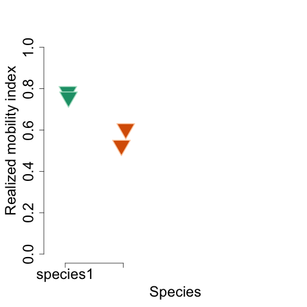

<!--
%\VignetteEngine{knitr::docco_classic}
%\VignetteIndexEntry{An Introduction to the animalmove package}
-->

Realized Mobility Index
=======================================


Load package library

```r
library(animalmove)
```


Subsample Data
------------

Khulan dataset has been saved in the package data directory , and loaded on the package load.

Raw **khulan** dataset contains unlaltered original data.


```r
data(khulan.raw.data)
head(khulan.raw.data)
```

```
##   id    sex                time      X       Y   lat   lon age elevation
## 1  3 female 2009-07-20 12:47:00 498117 5026295 45.39 92.98 5-6      1361
## 2  3 female 2009-07-20 12:59:00 494908 5026062 45.39 92.93 5-6      1359
## 3  3 female 2009-07-20 13:12:00 493784 5026159 45.39 92.92 5-6      1357
## 4  3 female 2009-07-20 13:25:00 493014 5026142 45.39 92.91 5-6      1357
## 5  3 female 2009-07-20 13:38:00 492374 5026252 45.39 92.90 5-6      1353
## 6  3 female 2009-07-20 13:51:00 491814 5026458 45.39 92.90 5-6      1353
##   vegetation behaviour  unixTime
## 1          9           1.248e+09
## 2          9       TRA 1.248e+09
## 3          9       TRA 1.248e+09
## 4         10       TRA 1.248e+09
## 5          6       TRA 1.248e+09
## 6          9       TRA 1.248e+09
```


Number of rows in the khulan.raw.data

```r
nrow(khulan.raw.data)
```

```
## [1] 222632
```


For demonstration purposes we add a column that indicates a specie type to the data frame for each relocation data.

Enhanced dataset has been saved into khulan.test.data a column pop.type, which indicates a specie type.

Specie type assignment rule:  Individuals with ids 3,4,7, 6441 assigned to the specie1 type, and the rest is identified as specie2 type.


```r
data(khulan.test.data)
head(khulan.test.data)
```

```
##    id    sex                time      X       Y   lat   lon age elevation
## 1:  3 female 2009-07-20 12:47:00 498117 5026295 45.39 92.98 5-6      1361
## 2:  3 female 2009-07-20 12:59:00 494908 5026062 45.39 92.93 5-6      1359
## 3:  3 female 2009-07-20 13:12:00 493784 5026159 45.39 92.92 5-6      1357
## 4:  3 female 2009-07-20 13:25:00 493014 5026142 45.39 92.91 5-6      1357
## 5:  3 female 2009-07-20 13:38:00 492374 5026252 45.39 92.90 5-6      1353
## 6:  3 female 2009-07-20 13:51:00 491814 5026458 45.39 92.90 5-6      1353
##    vegetation behaviour  unixTime pop.type
## 1:          9           1.248e+09 species1
## 2:          9       TRA 1.248e+09 species1
## 3:          9       TRA 1.248e+09 species1
## 4:         10       TRA 1.248e+09 species1
## 5:          6       TRA 1.248e+09 species1
## 6:          9       TRA 1.248e+09 species1
```


Number of rows in the khulan.test.data


```r
nrow(khulan.test.data)
```

```
## [1] 222632
```


### Subsample data within time interval
--------------------------------------

We select at most 6 individuals within 2009, time interval 50 hours, and accuracy 50 hours, and subsampling scheme for Realized Mobility Index

```r
rmi.subsample.data <- subsample(khulan.test.data, start = c("2009-01-01 00:00"), 
    end = "2009-12-31 00:00", interval = c("50 hours"), accuracy = c("3 mins"), 
    minIndiv = 3, maxIndiv = 6, mustIndiv = NULL, index.type = "rmi")

head(rmi.subsample.data)
```

```
##   overlapID           scantimes   id    sex                time      X
## 1       100 2009-07-26 06:00:00    3 female 2009-07-26 06:00:00 481551
## 2       100 2009-07-26 06:00:00 6441   male 2009-07-26 06:00:00 546746
## 3       100 2009-07-26 06:00:00 6446 female 2009-07-26 06:00:00 506485
## 4       100 2009-07-26 06:00:00 7376 female 2009-07-26 06:00:00 508983
## 5       102 2009-07-30 10:00:00    3 female 2009-07-30 09:57:00 480753
## 6       102 2009-07-30 10:00:00 6441   male 2009-07-30 10:00:00 545652
##         Y   lat   lon age elevation vegetation behaviour  unixTime
## 1 5023605 45.37 92.76 5-6      1373          9       GRA 1.249e+09
## 2 5014428 45.28 93.60  15      1591          9       GRA 1.249e+09
## 3 5040413 45.52 93.08  15      1536          6       RST 1.249e+09
## 4 5011316 45.26 93.11 2-3      1560         10       TRA 1.249e+09
## 5 5030332 45.43 92.75 5-6      1300          9       TRA 1.249e+09
## 6 5013327 45.27 93.58  15      1608          9       GRA 1.249e+09
##   pop.type   time.lag
## 1 species1 2.083 days
## 2 species1 2.083 days
## 3 species2 2.083 days
## 4 species2 2.083 days
## 5 species1 6.248 days
## 6 species1 6.250 days
```


Note, a number of rows in the rmi subsample dataset


```r
nrow(rmi.subsample.data)
```

```
## [1] 144
```


### Prepare data for the analysis in the spatial form
----------------------------

Create attribute data frame


```r
dt.rmi.data <- data.table(rmi.subsample.data)

dt.rmi.data.attr <- dt.rmi.data[, list(id = id, pop.type = pop.type, x = X, 
    y = Y, time = time, time.lag = time.lag, age = age, elevation = elevation, 
    behaviour = behaviour)]
str(dt.rmi.data.attr)
```

```
## Classes 'data.table' and 'data.frame':	144 obs. of  9 variables:
##  $ id       : int  3 6441 6446 7376 3 6441 6446 7376 3 6441 ...
##  $ pop.type : chr  "species1" "species1" "species2" "species2" ...
##  $ x        : num  481551 546746 506485 508983 480753 ...
##  $ y        : num  5023605 5014428 5040413 5011316 5030332 ...
##  $ time     : POSIXct, format: "2009-07-26 06:00:00" "2009-07-26 06:00:00" ...
##  $ time.lag :Class 'difftime'  atomic [1:144] 2.08 2.08 2.08 2.08 6.25 ...
##   .. ..- attr(*, "tzone")= chr "GMT"
##   .. ..- attr(*, "units")= chr "days"
##  $ age      : Factor w/ 5 levels "12","15","2-3",..: 5 2 2 3 5 2 2 3 5 2 ...
##  $ elevation: int  1373 1591 1536 1560 1300 1608 1448 1531 1329 1596 ...
##  $ behaviour: Factor w/ 4 levels "","GRA","RST",..: 2 2 3 4 4 2 2 2 2 3 ...
##  - attr(*, ".internal.selfref")=<externalptr>
```


Create spatial coordinates

```r
dt.rmi.data.xy <- dt.rmi.data[, list(x = X, y = Y)]

str(dt.rmi.data.xy)
```

```
## Classes 'data.table' and 'data.frame':	144 obs. of  2 variables:
##  $ x: num  481551 546746 506485 508983 480753 ...
##  $ y: num  5023605 5014428 5040413 5011316 5030332 ...
##  - attr(*, ".internal.selfref")=<externalptr>
```


Create spatial points

```r
xy.sp.rmi.data <- SpatialPoints(dt.rmi.data.xy)
```


Create spatial points data frame with attributes

```r
xy.rmi.data.spdf <- SpatialPointsDataFrame(xy.sp.rmi.data, dt.rmi.data.attr)
```


Create Individuals data.frame - relocations of khulan data

```r
khulan.reloc.spatial <- Individuals(xy.rmi.data.spdf, group.by = "pop.type")
head(khulan.reloc.spatial)
```

```
##         coordinates   id pop.type      x       y                time
## 1 (481551, 5023610)    3 species1 481551 5023605 2009-07-26 06:00:00
## 2 (546746, 5014430) 6441 species1 546746 5014428 2009-07-26 06:00:00
## 3 (506485, 5040410) 6446 species2 506485 5040413 2009-07-26 06:00:00
## 4 (508983, 5011320) 7376 species2 508983 5011316 2009-07-26 06:00:00
## 5 (480753, 5030330)    3 species1 480753 5030332 2009-07-30 09:57:00
## 6 (545652, 5013330) 6441 species1 545652 5013327 2009-07-30 10:00:00
##     time.lag age elevation behaviour
## 1 2.083 days 5-6      1373       GRA
## 2 2.083 days  15      1591       GRA
## 3 2.083 days  15      1536       RST
## 4 2.083 days 2-3      1560       TRA
## 5 6.248 days 5-6      1300       TRA
## 6 6.250 days  15      1608       GRA
## Coordinate Reference System (CRS) arguments: NA
```


Analysis
----------------------------


```r
xy.rmi.data.spdf <- SpatialPointsDataFrame(xy.sp.rmi.data, dt.rmi.data.attr)
```


Compute individual mcp

```r
individual.mcp <- mcp(khulan.reloc.spatial[, 1], percent = 100)
```


### Display individual mcp
----------------------------------

individual.mcp

```r
individual.mcp
```

```
## Object of class "SpatialPolygonsDataFrame" (package sp):
## 
## Number of SpatialPolygons:  4
## 
## Variables measured:
##        id   area
## 3       3 504958
## 6441 6441 488118
## 6446 6446 356768
## 7376 7376 309509
```


### Compute population mcp
----------------------------------

```r
population.mcp <- mcp.population(khulan.reloc.spatial, percent = 100)
```


* Display population mcp

```r
population.mcp
```

```
## Object of class "SpatialPolygonsDataFrame" (package sp):
## 
## Number of SpatialPolygons:  2
## 
## Variables measured:
##                id   area
## species1 species1 642820
## species2 species2 588873
```


### Compute Realized Mobility Index
----------------------------------

```r
rmi.index.population <- rmi.index(khulan.reloc.spatial, percent = 100, id = "id")

rmi.object <- RMIndex(rmi.index.population)
```


RMI Data 

```r
rmi.object@data
```

```
##     id pop.type ind.home.range pop.home.range rmi.index
## 1    3 species1         504958         642820    0.7855
## 2 6441 species1         488118         642820    0.7593
## 3 6446 species2         356768         588873    0.6058
## 4 7376 species2         309509         588873    0.5256
```


### RMI Summary
----------------------------------

```r
summary(rmi.object)
```

```
## $species1
##    Min. 1st Qu.  Median    Mean 3rd Qu.    Max. 
##   0.759   0.766   0.772   0.772   0.779   0.786 
## 
## $species2
##    Min. 1st Qu.  Median    Mean 3rd Qu.    Max. 
##   0.526   0.546   0.566   0.566   0.586   0.606
```

### Plot Results
----------------------------------


```r
par(mar = c(5, 5, 2, 0))
plot(rmi.object)
```




