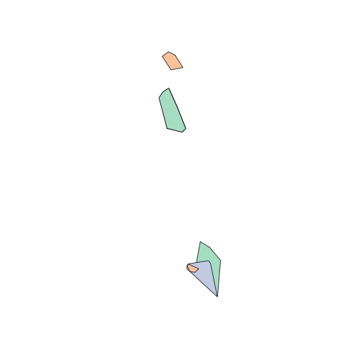
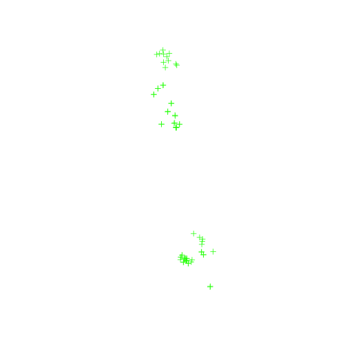
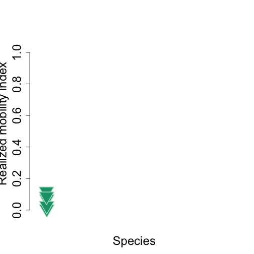

<!--
%\VignetteEngine{knitr::docco_classic}
%\VignetteIndexEntry{An Introduction to the animalmove package}
-->

Realized Mobility Index
=======================================


Load package library

```r
library(lubridate)
library(animalmove)
library(plyr)
```


Subsample Data
------------

Buffalo dataset has been saved in the package data directory , and loaded on the package load.

Raw **buffalo** dataset contains unaltered original data.


```r

data(buffalo)
head(buffalo)
```

```
##   event.id visible               timestamp location.long location.lat
## 1 10210419    true 2005-02-17 05:05:00.000         31.77       -24.54
## 2 10210423    true 2005-02-17 05:05:00.000         31.77       -24.54
## 3 10210428    true 2005-02-17 06:08:00.000         31.76       -24.54
## 4 10210434    true 2005-02-17 06:08:00.000         31.76       -24.54
## 5 10210456    true 2005-02-17 07:05:00.000         31.76       -24.55
## 6 10210458    true 2005-02-17 08:05:00.000         31.76       -24.55
##   behavioural.classification comments manually.marked.outlier sensor.type
## 1                          0     24.3                      NA         gps
## 2                          0     24.3                      NA         gps
## 3                          0     29.5                      NA         gps
## 4                          0     29.5                      NA         gps
## 5                          0     35.8                      NA         gps
## 6                          0     37.3                      NA         gps
##   individual.taxon.canonical.name tag.local.identifier
## 1                 Syncerus caffer             #1764820
## 2                 Syncerus caffer             #1764820
## 3                 Syncerus caffer             #1764820
## 4                 Syncerus caffer             #1764820
## 5                 Syncerus caffer             #1764820
## 6                 Syncerus caffer             #1764820
##   individual.local.identifier
## 1                       Queen
## 2                       Queen
## 3                       Queen
## 4                       Queen
## 5                       Queen
## 6                       Queen
##                                           study.name utm.easting
## 1 Kruger African Buffalo, GPS tracking, South Africa      375051
## 2 Kruger African Buffalo, GPS tracking, South Africa      375051
## 3 Kruger African Buffalo, GPS tracking, South Africa      374851
## 4 Kruger African Buffalo, GPS tracking, South Africa      374851
## 5 Kruger African Buffalo, GPS tracking, South Africa      374527
## 6 Kruger African Buffalo, GPS tracking, South Africa      374492
##   utm.northing utm.zone             study.timezone   study.local.timestamp
## 1      7285726      36S South Africa Standard Time 2005-02-17 07:05:00.000
## 2      7285726      36S South Africa Standard Time 2005-02-17 07:05:00.000
## 3      7285502      36S South Africa Standard Time 2005-02-17 08:08:00.000
## 4      7285502      36S South Africa Standard Time 2005-02-17 08:08:00.000
## 5      7284538      36S South Africa Standard Time 2005-02-17 09:05:00.000
## 6      7284644      36S South Africa Standard Time 2005-02-17 10:05:00.000
```

```r

nrow(buffalo)
```

```
## [1] 28410
```

```r

currentnames <- colnames(buffalo)
currentnames
```

```
##  [1] "event.id"                        "visible"                        
##  [3] "timestamp"                       "location.long"                  
##  [5] "location.lat"                    "behavioural.classification"     
##  [7] "comments"                        "manually.marked.outlier"        
##  [9] "sensor.type"                     "individual.taxon.canonical.name"
## [11] "tag.local.identifier"            "individual.local.identifier"    
## [13] "study.name"                      "utm.easting"                    
## [15] "utm.northing"                    "utm.zone"                       
## [17] "study.timezone"                  "study.local.timestamp"
```

```r

names(buffalo)[names(buffalo) == "timestamp"] <- "time"
names(buffalo)[names(buffalo) == "utm.easting"] <- "x"
names(buffalo)[names(buffalo) == "utm.northing"] <- "y"
names(buffalo)[names(buffalo) == "tag.local.identifier"] <- "id"
names(buffalo)[names(buffalo) == "individual.taxon.canonical.name"] <- "pop.type"

# Data Conversion
buffalo$time <- as.POSIXct(strptime(buffalo$time, format = "%Y-%m-%d %H:%M", 
    tz = "GMT"))

# Display new names
newnames <- colnames(buffalo)
newnames
```

```
##  [1] "event.id"                    "visible"                    
##  [3] "time"                        "location.long"              
##  [5] "location.lat"                "behavioural.classification" 
##  [7] "comments"                    "manually.marked.outlier"    
##  [9] "sensor.type"                 "pop.type"                   
## [11] "id"                          "individual.local.identifier"
## [13] "study.name"                  "x"                          
## [15] "y"                           "utm.zone"                   
## [17] "study.timezone"              "study.local.timestamp"
```

```r
head(buffalo)
```

```
##   event.id visible                time location.long location.lat
## 1 10210419    true 2005-02-17 05:05:00         31.77       -24.54
## 2 10210423    true 2005-02-17 05:05:00         31.77       -24.54
## 3 10210428    true 2005-02-17 06:08:00         31.76       -24.54
## 4 10210434    true 2005-02-17 06:08:00         31.76       -24.54
## 5 10210456    true 2005-02-17 07:05:00         31.76       -24.55
## 6 10210458    true 2005-02-17 08:05:00         31.76       -24.55
##   behavioural.classification comments manually.marked.outlier sensor.type
## 1                          0     24.3                      NA         gps
## 2                          0     24.3                      NA         gps
## 3                          0     29.5                      NA         gps
## 4                          0     29.5                      NA         gps
## 5                          0     35.8                      NA         gps
## 6                          0     37.3                      NA         gps
##          pop.type       id individual.local.identifier
## 1 Syncerus caffer #1764820                       Queen
## 2 Syncerus caffer #1764820                       Queen
## 3 Syncerus caffer #1764820                       Queen
## 4 Syncerus caffer #1764820                       Queen
## 5 Syncerus caffer #1764820                       Queen
## 6 Syncerus caffer #1764820                       Queen
##                                           study.name      x       y
## 1 Kruger African Buffalo, GPS tracking, South Africa 375051 7285726
## 2 Kruger African Buffalo, GPS tracking, South Africa 375051 7285726
## 3 Kruger African Buffalo, GPS tracking, South Africa 374851 7285502
## 4 Kruger African Buffalo, GPS tracking, South Africa 374851 7285502
## 5 Kruger African Buffalo, GPS tracking, South Africa 374527 7284538
## 6 Kruger African Buffalo, GPS tracking, South Africa 374492 7284644
##   utm.zone             study.timezone   study.local.timestamp
## 1      36S South Africa Standard Time 2005-02-17 07:05:00.000
## 2      36S South Africa Standard Time 2005-02-17 07:05:00.000
## 3      36S South Africa Standard Time 2005-02-17 08:08:00.000
## 4      36S South Africa Standard Time 2005-02-17 08:08:00.000
## 5      36S South Africa Standard Time 2005-02-17 09:05:00.000
## 6      36S South Africa Standard Time 2005-02-17 10:05:00.000
```


Number of rows in the buffalo data & data set structure 

```r
length(table((buffalo$id)))
```

```
## [1] 6
```

```r

str(buffalo)
```

```
## 'data.frame':	28410 obs. of  18 variables:
##  $ event.id                   : int  10210419 10210423 10210428 10210434 10210456 10210458 10210483 10210535 10210544 10210558 ...
##  $ visible                    : chr  "true" "true" "true" "true" ...
##  $ time                       : POSIXct, format: "2005-02-17 05:05:00" "2005-02-17 05:05:00" ...
##  $ location.long              : num  31.8 31.8 31.8 31.8 31.8 ...
##  $ location.lat               : num  -24.5 -24.5 -24.5 -24.5 -24.5 ...
##  $ behavioural.classification : int  0 0 0 0 0 0 0 0 0 0 ...
##  $ comments                   : num  24.3 24.3 29.5 29.5 35.8 37.3 38.9 39.6 40 38.1 ...
##  $ manually.marked.outlier    : logi  NA NA NA NA NA NA ...
##  $ sensor.type                : chr  "gps" "gps" "gps" "gps" ...
##  $ pop.type                   : chr  "Syncerus caffer" "Syncerus caffer" "Syncerus caffer" "Syncerus caffer" ...
##  $ id                         : chr  "#1764820" "#1764820" "#1764820" "#1764820" ...
##  $ individual.local.identifier: chr  "Queen" "Queen" "Queen" "Queen" ...
##  $ study.name                 : chr  "Kruger African Buffalo, GPS tracking, South Africa" "Kruger African Buffalo, GPS tracking, South Africa" "Kruger African Buffalo, GPS tracking, South Africa" "Kruger African Buffalo, GPS tracking, South Africa" ...
##  $ x                          : num  375051 375051 374851 374851 374527 ...
##  $ y                          : num  7285726 7285726 7285502 7285502 7284538 ...
##  $ utm.zone                   : chr  "36S" "36S" "36S" "36S" ...
##  $ study.timezone             : chr  "South Africa Standard Time" "South Africa Standard Time" "South Africa Standard Time" "South Africa Standard Time" ...
##  $ study.local.timestamp      : chr  "2005-02-17 07:05:00.000" "2005-02-17 07:05:00.000" "2005-02-17 08:08:00.000" "2005-02-17 08:08:00.000" ...
```


### Subsample data within time interval
--------------------------------------

We select at most 6 individuals within 2009, time interval 50 hours, and accuracy 50 hours, and subsampling scheme for Realized Mobility Index

```r
rmi.subsample.data <- subsample(dat = buffalo, start = c("2005-02-17 00:00:00"), 
    end = "2006-12-31 00:00:00", interval = c("50 hours"), accuracy = c("3 hours"), 
    minIndiv = 3, maxIndiv = 6, mustIndiv = NULL, index.type = "rmi")
```

```
## [1] "50 hours"
## [1] "3 hours"
## [1] "2005-02-17 00:00:00"
## 'data.frame':	8 obs. of  9 variables:
##  $ numberOfIndividuals: int  3 4 5 6 5 5 4 3
##  $ pairsOfCompleteSets: int  32 19 8 7 9 18 37 49
##  $ completeSets       : int  34 21 10 9 10 20 39 52
##  $ scanInterval       : chr  "50 hours" "50 hours" "50 hours" "50 hours" ...
##  $ scanAccuracy       : chr  "3 hours" "3 hours" "3 hours" "3 hours" ...
##  $ firstScantime      : chr  "2005-02-17 00:00:00" "2005-02-17 00:00:00" "2005-02-17 00:00:00" "2005-02-17 00:00:00" ...
##  $ firstOverlap       : chr  "2005-07-27 10:00" "2005-08-23 12:00" "2005-09-15 10:00" "2005-09-17 12:00" ...
##  $ lastOverlap        : chr  "2005-10-06 06:00" "2005-10-06 06:00" "2005-10-06 06:00" "2005-10-06 06:00" ...
##  $ lastScantime       : chr  "2006-12-31 00:00:00" "2006-12-31 00:00:00" "2006-12-31 00:00:00" "2006-12-31 00:00:00" ...
```

```r

buffalo.indiv <- Individuals(rmi.subsample.data, id = "id", time = "time", x = "x", 
    y = "y", group.by = "pop.type", proj4string = CRS("+proj=utm +zone=28 +datum=WGS84"))

head(coordinates(buffalo.indiv))
```

```
##           x       y
## [1,] 379324 7284955
## [2,] 382640 7229598
## [3,] 380536 7228975
## [4,] 389349 7240278
## [5,] 374549 7313427
## [6,] 379227 7285125
```

```r
bbox(buffalo.indiv)
```

```
##       min     max
## x  369957  394639
## y 7227424 7319263
```

```r
head(show(buffalo.indiv), 2)
```

```
##          coordinates overlapID           scantimes event.id visible
## 1  (379300, 7285000)       103 2005-09-17 12:00:00 10211772    true
## 2  (382600, 7230000)       103 2005-09-17 12:00:00 10229364    true
## 3  (380500, 7229000)       103 2005-09-17 12:00:00 10224835    true
## 4  (389300, 7240000)       103 2005-09-17 12:00:00 10204246    true
## 5  (374500, 7313000)       103 2005-09-17 12:00:00 10220195    true
## 6  (379200, 7285000)       103 2005-09-17 12:00:00 10205646    true
## 7  (379200, 7291000)       104 2005-09-19 14:00:00 10212657    true
## 8  (383200, 7229000)       104 2005-09-19 14:00:00 10230775    true
## 9  (383200, 7229000)       104 2005-09-19 14:00:00 10224884    true
## 10 (389900, 7235000)       104 2005-09-19 14:00:00 10204295    true
## 11 (372900, 7314000)       104 2005-09-19 14:00:00 10221098    true
## 12 (379200, 7291000)       104 2005-09-19 14:00:00 10206456    true
## 13 (378800, 7290000)       106 2005-09-23 18:00:00 10214136    true
## 14 (380900, 7231000)       106 2005-09-23 18:00:00 10228289    true
## 15 (381000, 7231000)       106 2005-09-23 18:00:00 10224985    true
## 16 (394600, 7238000)       106 2005-09-23 18:00:00 10204404    true
## 17 (376600, 7312000)       106 2005-09-23 18:00:00 10222646    true
## 18 (379100, 7290000)       106 2005-09-23 18:00:00 10208141    true
## 19 (375100, 7291000)       107 2005-09-25 20:00:00 10214784    true
## 20 (382000, 7231000)       107 2005-09-25 20:00:00 10229833    true
## 21 (382000, 7231000)       107 2005-09-25 20:00:00 10225034    true
## 22 (386700, 7242000)       107 2005-09-25 20:00:00 10204453    true
## 23 (374300, 7312000)       107 2005-09-25 20:00:00 10217164    true
## 24 (374600, 7290000)       107 2005-09-25 20:00:00 10209172    true
## 25 (376500, 7289000)       108 2005-09-27 22:00:00 10215534    true
## 26 (383500, 7229000)       108 2005-09-27 22:00:00 10226792    true
## 27 (383600, 7230000)       108 2005-09-27 22:00:00 10225083    true
## 28 (390100, 7236000)       108 2005-09-27 22:00:00 10204512    true
## 29 (373700, 7315000)       108 2005-09-27 22:00:00 10217948    true
## 30 (376400, 7289000)       108 2005-09-27 22:00:00 10209954    true
## 31 (379900, 7285000)       109 2005-09-30 00:00:00 10216058    true
## 32 (384500, 7229000)       109 2005-09-30 00:00:00 10227947    true
## 33 (384600, 7229000)       109 2005-09-30 00:00:00 10225134    true
## 34 (384500, 7229000)       109 2005-09-30 00:00:00 10204566    true
## 35 (374100, 7313000)       109 2005-09-30 00:00:00 10218844    true
## 36 (380000, 7285000)       109 2005-09-30 00:00:00 10205673    true
## 37 (371600, 7300000)       110 2005-10-02 02:00:00 10216558    true
## 38 (385100, 7227000)       110 2005-10-02 02:00:00 10228849    true
## 39 (385100, 7227000)       110 2005-10-02 02:00:00 10225183    true
## 40 (385000, 7227000)       110 2005-10-02 02:00:00 10204621    true
## 41 (374700, 7319000)       110 2005-10-02 02:00:00 10219708    true
## 42 (371600, 7300000)       110 2005-10-02 02:00:00 10206307    true
## 43 (370000, 7301000)       111 2005-10-04 04:00:00 10210649    true
## 44 (385100, 7233000)       111 2005-10-04 04:00:00 10229546    true
## 45 (391100, 7232000)       111 2005-10-04 04:00:00 10225232    true
## 46 (391200, 7232000)       111 2005-10-04 04:00:00 10204670    true
## 47 (378700, 7313000)       111 2005-10-04 04:00:00 10220654    true
## 48 (370000, 7301000)       111 2005-10-04 04:00:00 10207096    true
## 49 (372600, 7301000)       112 2005-10-06 06:00:00 10211321    true
## 50 (383000, 7227000)       112 2005-10-06 06:00:00 10230511    true
## 51 (392400, 7231000)       112 2005-10-06 06:00:00 10225282    true
## 52 (392400, 7230000)       112 2005-10-06 06:00:00 10204719    true
## 53 (377700, 7311000)       112 2005-10-06 06:00:00 10221501    true
## 54 (373500, 7302000)       112 2005-10-06 06:00:00 10207860    true
##                   time location.long location.lat
## 1  2005-09-17 11:54:00         31.81       -24.54
## 2  2005-09-17 11:59:00         31.84       -25.04
## 3  2005-09-17 12:26:00         31.82       -25.05
## 4  2005-09-17 11:54:00         31.90       -24.95
## 5  2005-09-17 11:32:00         31.76       -24.29
## 6  2005-09-17 12:15:00         31.81       -24.54
## 7  2005-09-19 14:14:00         31.81       -24.49
## 8  2005-09-19 13:59:00         31.84       -25.05
## 9  2005-09-19 14:26:00         31.84       -25.05
## 10 2005-09-19 13:54:00         31.91       -25.00
## 11 2005-09-19 13:32:00         31.75       -24.28
## 12 2005-09-19 13:31:00         31.81       -24.49
## 13 2005-09-23 18:21:00         31.80       -24.50
## 14 2005-09-23 17:59:00         31.82       -25.04
## 15 2005-09-23 18:25:00         31.82       -25.03
## 16 2005-09-23 17:54:00         31.96       -24.97
## 17 2005-09-23 17:31:00         31.78       -24.30
## 18 2005-09-23 17:39:00         31.81       -24.50
## 19 2005-09-25 20:21:00         31.77       -24.49
## 20 2005-09-25 19:58:00         31.83       -25.04
## 21 2005-09-25 20:25:00         31.83       -25.03
## 22 2005-09-25 19:53:00         31.88       -24.94
## 23 2005-09-25 19:31:00         31.76       -24.30
## 24 2005-09-25 19:38:00         31.76       -24.50
## 25 2005-09-27 22:21:00         31.78       -24.51
## 26 2005-09-27 21:58:00         31.84       -25.05
## 27 2005-09-27 22:25:00         31.85       -25.05
## 28 2005-09-27 21:53:00         31.91       -24.99
## 29 2005-09-27 21:31:00         31.76       -24.27
## 30 2005-09-27 21:42:00         31.78       -24.51
## 31 2005-09-30 02:52:00         31.81       -24.54
## 32 2005-09-29 23:58:00         31.86       -25.05
## 33 2005-09-30 00:25:00         31.86       -25.05
## 34 2005-09-29 23:53:00         31.85       -25.05
## 35 2005-09-29 23:31:00         31.76       -24.29
## 36 2005-09-29 23:44:00         31.82       -24.54
## 37 2005-10-02 02:05:00         31.73       -24.41
## 38 2005-10-02 01:58:00         31.86       -25.06
## 39 2005-10-02 02:24:00         31.86       -25.06
## 40 2005-10-02 01:52:00         31.86       -25.06
## 41 2005-10-02 01:31:00         31.77       -24.23
## 42 2005-10-02 01:43:00         31.73       -24.41
## 43 2005-10-04 03:37:00         31.72       -24.40
## 44 2005-10-04 03:57:00         31.86       -25.02
## 45 2005-10-04 04:24:00         31.92       -25.02
## 46 2005-10-04 03:52:00         31.92       -25.02
## 47 2005-10-04 03:30:00         31.80       -24.29
## 48 2005-10-04 03:46:00         31.72       -24.40
## 49 2005-10-06 03:06:00         31.74       -24.40
## 50 2005-10-06 05:57:00         31.84       -25.06
## 51 2005-10-06 06:24:00         31.93       -25.04
## 52 2005-10-06 05:52:00         31.93       -25.04
## 53 2005-10-06 05:30:00         31.79       -24.31
## 54 2005-10-06 05:43:00         31.75       -24.39
##    behavioural.classification comments manually.marked.outlier sensor.type
## 1                           0     37.0                      NA         gps
## 2                           0     42.4                      NA         gps
## 3                           0     42.4                      NA         gps
## 4                           0     40.0                      NA         gps
## 5                           0     44.0                      NA         gps
## 6                           0     37.7                      NA         gps
## 7                           0     35.5                      NA         gps
## 8                           0     37.0                      NA         gps
## 9                           0     39.2                      NA         gps
## 10                          0     35.1                      NA         gps
## 11                          0     36.2                      NA         gps
## 12                          0     38.1                      NA         gps
## 13                          0     30.6                      NA         gps
## 14                          0     31.8                      NA         gps
## 15                          0     30.6                      NA         gps
## 16                          0     31.4                      NA         gps
## 17                          0     28.8                      NA         gps
## 18                          0     31.0                      NA         gps
## 19                          0     32.5                      NA         gps
## 20                          0     33.6                      NA         gps
## 21                          0     32.1                      NA         gps
## 22                          0     31.8                      NA         gps
## 23                          0     31.0                      NA         gps
## 24                          0     32.1                      NA         gps
## 25                          0     22.1                      NA         gps
## 26                          0     22.8                      NA         gps
## 27                          0     22.8                      NA         gps
## 28                          0     20.2                      NA         gps
## 29                          0     20.6                      NA         gps
## 30                          0     23.2                      NA         gps
## 31                          0     17.4                      NA         gps
## 32                          0     19.4                      NA         gps
## 33                          0     18.6                      NA         gps
## 34                          0     17.4                      NA         gps
## 35                          0     17.0                      NA         gps
## 36                          0     20.9                      NA         gps
## 37                          0     21.3                      NA         gps
## 38                          0     24.3                      NA         gps
## 39                          0     22.8                      NA         gps
## 40                          0     23.2                      NA         gps
## 41                          0     22.1                      NA         gps
## 42                          0     22.5                      NA         gps
## 43                          0     23.2                      NA         gps
## 44                          0     24.7                      NA         gps
## 45                          0     24.7                      NA         gps
## 46                          0     23.6                      NA         gps
## 47                          0     21.7                      NA         gps
## 48                          0     24.0                      NA         gps
## 49                          0     20.9                      NA         gps
## 50                          0     23.2                      NA         gps
## 51                          0     22.1                      NA         gps
## 52                          0     20.6                      NA         gps
## 53                          0     20.9                      NA         gps
## 54                          0     22.5                      NA         gps
##           pop.type       id individual.local.identifier
## 1  Syncerus caffer #1764820                       Queen
## 2  Syncerus caffer #1764823                        Gabs
## 3  Syncerus caffer #1764826                       Cilla
## 4  Syncerus caffer #1764829                       Mvubu
## 5  Syncerus caffer #1764832                        Toni
## 6  Syncerus caffer #1764835                      Pepper
## 7  Syncerus caffer #1764820                       Queen
## 8  Syncerus caffer #1764823                        Gabs
## 9  Syncerus caffer #1764826                       Cilla
## 10 Syncerus caffer #1764829                       Mvubu
## 11 Syncerus caffer #1764832                        Toni
## 12 Syncerus caffer #1764835                      Pepper
## 13 Syncerus caffer #1764820                       Queen
## 14 Syncerus caffer #1764823                        Gabs
## 15 Syncerus caffer #1764826                       Cilla
## 16 Syncerus caffer #1764829                       Mvubu
## 17 Syncerus caffer #1764832                        Toni
## 18 Syncerus caffer #1764835                      Pepper
## 19 Syncerus caffer #1764820                       Queen
## 20 Syncerus caffer #1764823                        Gabs
## 21 Syncerus caffer #1764826                       Cilla
## 22 Syncerus caffer #1764829                       Mvubu
## 23 Syncerus caffer #1764832                        Toni
## 24 Syncerus caffer #1764835                      Pepper
## 25 Syncerus caffer #1764820                       Queen
## 26 Syncerus caffer #1764823                        Gabs
## 27 Syncerus caffer #1764826                       Cilla
## 28 Syncerus caffer #1764829                       Mvubu
## 29 Syncerus caffer #1764832                        Toni
## 30 Syncerus caffer #1764835                      Pepper
## 31 Syncerus caffer #1764820                       Queen
## 32 Syncerus caffer #1764823                        Gabs
## 33 Syncerus caffer #1764826                       Cilla
## 34 Syncerus caffer #1764829                       Mvubu
## 35 Syncerus caffer #1764832                        Toni
## 36 Syncerus caffer #1764835                      Pepper
## 37 Syncerus caffer #1764820                       Queen
## 38 Syncerus caffer #1764823                        Gabs
## 39 Syncerus caffer #1764826                       Cilla
## 40 Syncerus caffer #1764829                       Mvubu
## 41 Syncerus caffer #1764832                        Toni
## 42 Syncerus caffer #1764835                      Pepper
## 43 Syncerus caffer #1764820                       Queen
## 44 Syncerus caffer #1764823                        Gabs
## 45 Syncerus caffer #1764826                       Cilla
## 46 Syncerus caffer #1764829                       Mvubu
## 47 Syncerus caffer #1764832                        Toni
## 48 Syncerus caffer #1764835                      Pepper
## 49 Syncerus caffer #1764820                       Queen
## 50 Syncerus caffer #1764823                        Gabs
## 51 Syncerus caffer #1764826                       Cilla
## 52 Syncerus caffer #1764829                       Mvubu
## 53 Syncerus caffer #1764832                        Toni
## 54 Syncerus caffer #1764835                      Pepper
##                                            study.name utm.zone
## 1  Kruger African Buffalo, GPS tracking, South Africa      36S
## 2  Kruger African Buffalo, GPS tracking, South Africa      36S
## 3  Kruger African Buffalo, GPS tracking, South Africa      36S
## 4  Kruger African Buffalo, GPS tracking, South Africa      36S
## 5  Kruger African Buffalo, GPS tracking, South Africa      36S
## 6  Kruger African Buffalo, GPS tracking, South Africa      36S
## 7  Kruger African Buffalo, GPS tracking, South Africa      36S
## 8  Kruger African Buffalo, GPS tracking, South Africa      36S
## 9  Kruger African Buffalo, GPS tracking, South Africa      36S
## 10 Kruger African Buffalo, GPS tracking, South Africa      36S
## 11 Kruger African Buffalo, GPS tracking, South Africa      36S
## 12 Kruger African Buffalo, GPS tracking, South Africa      36S
## 13 Kruger African Buffalo, GPS tracking, South Africa      36S
## 14 Kruger African Buffalo, GPS tracking, South Africa      36S
## 15 Kruger African Buffalo, GPS tracking, South Africa      36S
## 16 Kruger African Buffalo, GPS tracking, South Africa      36S
## 17 Kruger African Buffalo, GPS tracking, South Africa      36S
## 18 Kruger African Buffalo, GPS tracking, South Africa      36S
## 19 Kruger African Buffalo, GPS tracking, South Africa      36S
## 20 Kruger African Buffalo, GPS tracking, South Africa      36S
## 21 Kruger African Buffalo, GPS tracking, South Africa      36S
## 22 Kruger African Buffalo, GPS tracking, South Africa      36S
## 23 Kruger African Buffalo, GPS tracking, South Africa      36S
## 24 Kruger African Buffalo, GPS tracking, South Africa      36S
## 25 Kruger African Buffalo, GPS tracking, South Africa      36S
## 26 Kruger African Buffalo, GPS tracking, South Africa      36S
## 27 Kruger African Buffalo, GPS tracking, South Africa      36S
## 28 Kruger African Buffalo, GPS tracking, South Africa      36S
## 29 Kruger African Buffalo, GPS tracking, South Africa      36S
## 30 Kruger African Buffalo, GPS tracking, South Africa      36S
## 31 Kruger African Buffalo, GPS tracking, South Africa      36S
## 32 Kruger African Buffalo, GPS tracking, South Africa      36S
## 33 Kruger African Buffalo, GPS tracking, South Africa      36S
## 34 Kruger African Buffalo, GPS tracking, South Africa      36S
## 35 Kruger African Buffalo, GPS tracking, South Africa      36S
## 36 Kruger African Buffalo, GPS tracking, South Africa      36S
## 37 Kruger African Buffalo, GPS tracking, South Africa      36S
## 38 Kruger African Buffalo, GPS tracking, South Africa      36S
## 39 Kruger African Buffalo, GPS tracking, South Africa      36S
## 40 Kruger African Buffalo, GPS tracking, South Africa      36S
## 41 Kruger African Buffalo, GPS tracking, South Africa      36S
## 42 Kruger African Buffalo, GPS tracking, South Africa      36S
## 43 Kruger African Buffalo, GPS tracking, South Africa      36S
## 44 Kruger African Buffalo, GPS tracking, South Africa      36S
## 45 Kruger African Buffalo, GPS tracking, South Africa      36S
## 46 Kruger African Buffalo, GPS tracking, South Africa      36S
## 47 Kruger African Buffalo, GPS tracking, South Africa      36S
## 48 Kruger African Buffalo, GPS tracking, South Africa      36S
## 49 Kruger African Buffalo, GPS tracking, South Africa      36S
## 50 Kruger African Buffalo, GPS tracking, South Africa      36S
## 51 Kruger African Buffalo, GPS tracking, South Africa      36S
## 52 Kruger African Buffalo, GPS tracking, South Africa      36S
## 53 Kruger African Buffalo, GPS tracking, South Africa      36S
## 54 Kruger African Buffalo, GPS tracking, South Africa      36S
##                study.timezone   study.local.timestamp   time.lag
## 1  South Africa Standard Time 2005-09-17 13:54:00.000 52.08 days
## 2  South Africa Standard Time 2005-09-17 13:59:00.000 52.08 days
## 3  South Africa Standard Time 2005-09-17 14:26:00.000 52.10 days
## 4  South Africa Standard Time 2005-09-17 13:54:00.000 52.08 days
## 5  South Africa Standard Time 2005-09-17 13:32:00.000 52.06 days
## 6  South Africa Standard Time 2005-09-17 14:15:00.000 52.09 days
## 7  South Africa Standard Time 2005-09-19 16:14:00.000 54.18 days
## 8  South Africa Standard Time 2005-09-19 15:59:00.000 54.17 days
## 9  South Africa Standard Time 2005-09-19 16:26:00.000 54.18 days
## 10 South Africa Standard Time 2005-09-19 15:54:00.000 54.16 days
## 11 South Africa Standard Time 2005-09-19 15:32:00.000 54.15 days
## 12 South Africa Standard Time 2005-09-19 15:31:00.000 54.15 days
## 13 South Africa Standard Time 2005-09-23 20:21:00.000 58.35 days
## 14 South Africa Standard Time 2005-09-23 19:59:00.000 58.33 days
## 15 South Africa Standard Time 2005-09-23 20:25:00.000 58.35 days
## 16 South Africa Standard Time 2005-09-23 19:54:00.000 58.33 days
## 17 South Africa Standard Time 2005-09-23 19:31:00.000 58.31 days
## 18 South Africa Standard Time 2005-09-23 19:39:00.000 58.32 days
## 19 South Africa Standard Time 2005-09-25 22:21:00.000 60.43 days
## 20 South Africa Standard Time 2005-09-25 21:58:00.000 60.42 days
## 21 South Africa Standard Time 2005-09-25 22:25:00.000 60.43 days
## 22 South Africa Standard Time 2005-09-25 21:53:00.000 60.41 days
## 23 South Africa Standard Time 2005-09-25 21:31:00.000 60.40 days
## 24 South Africa Standard Time 2005-09-25 21:38:00.000 60.40 days
## 25 South Africa Standard Time 2005-09-28 00:21:00.000 62.51 days
## 26 South Africa Standard Time 2005-09-27 23:58:00.000 62.50 days
## 27 South Africa Standard Time 2005-09-28 00:25:00.000 62.52 days
## 28 South Africa Standard Time 2005-09-27 23:53:00.000 62.50 days
## 29 South Africa Standard Time 2005-09-27 23:31:00.000 62.48 days
## 30 South Africa Standard Time 2005-09-27 23:42:00.000 62.49 days
## 31 South Africa Standard Time 2005-09-30 04:52:00.000 64.70 days
## 32 South Africa Standard Time 2005-09-30 01:58:00.000 64.58 days
## 33 South Africa Standard Time 2005-09-30 02:25:00.000 64.60 days
## 34 South Africa Standard Time 2005-09-30 01:53:00.000 64.58 days
## 35 South Africa Standard Time 2005-09-30 01:31:00.000 64.56 days
## 36 South Africa Standard Time 2005-09-30 01:44:00.000 64.57 days
## 37 South Africa Standard Time 2005-10-02 04:05:00.000 66.67 days
## 38 South Africa Standard Time 2005-10-02 03:58:00.000 66.67 days
## 39 South Africa Standard Time 2005-10-02 04:24:00.000 66.68 days
## 40 South Africa Standard Time 2005-10-02 03:52:00.000 66.66 days
## 41 South Africa Standard Time 2005-10-02 03:31:00.000 66.65 days
## 42 South Africa Standard Time 2005-10-02 03:43:00.000 66.65 days
## 43 South Africa Standard Time 2005-10-04 05:37:00.000 68.73 days
## 44 South Africa Standard Time 2005-10-04 05:57:00.000 68.75 days
## 45 South Africa Standard Time 2005-10-04 06:24:00.000 68.77 days
## 46 South Africa Standard Time 2005-10-04 05:52:00.000 68.74 days
## 47 South Africa Standard Time 2005-10-04 05:30:00.000 68.73 days
## 48 South Africa Standard Time 2005-10-04 05:46:00.000 68.74 days
## 49 South Africa Standard Time 2005-10-06 05:06:00.000 70.71 days
## 50 South Africa Standard Time 2005-10-06 07:57:00.000 70.83 days
## 51 South Africa Standard Time 2005-10-06 08:24:00.000 70.85 days
## 52 South Africa Standard Time 2005-10-06 07:52:00.000 70.83 days
## 53 South Africa Standard Time 2005-10-06 07:30:00.000 70.81 days
## 54 South Africa Standard Time 2005-10-06 07:43:00.000 70.82 days
```

```
##         coordinates overlapID           scantimes event.id visible
## 1 (379300, 7285000)       103 2005-09-17 12:00:00 10211772    true
## 2 (382600, 7230000)       103 2005-09-17 12:00:00 10229364    true
##                  time location.long location.lat
## 1 2005-09-17 11:54:00         31.81       -24.54
## 2 2005-09-17 11:59:00         31.84       -25.04
##   behavioural.classification comments manually.marked.outlier sensor.type
## 1                          0     37.0                      NA         gps
## 2                          0     42.4                      NA         gps
##          pop.type       id individual.local.identifier
## 1 Syncerus caffer #1764820                       Queen
## 2 Syncerus caffer #1764823                        Gabs
##                                           study.name utm.zone
## 1 Kruger African Buffalo, GPS tracking, South Africa      36S
## 2 Kruger African Buffalo, GPS tracking, South Africa      36S
##               study.timezone   study.local.timestamp   time.lag
## 1 South Africa Standard Time 2005-09-17 13:54:00.000 52.08 days
## 2 South Africa Standard Time 2005-09-17 13:59:00.000 52.08 days
```

```r
head(SpatialPoints(buffalo.indiv), 2)
```

```
## SpatialPoints:
##           x       y
## [1,] 379324 7284955
## [2,] 382640 7229598
## Coordinate Reference System (CRS) arguments: NA
```

```r
coordnames(buffalo.indiv)
```

```
## [1] "x" "y"
```

```r

buffalo.data.attr <- as.data.frame(buffalo.indiv)
head(buffalo.data.attr)
```

```
##   overlapID           scantimes event.id visible                time
## 1       103 2005-09-17 12:00:00 10211772    true 2005-09-17 11:54:00
## 2       103 2005-09-17 12:00:00 10229364    true 2005-09-17 11:59:00
## 3       103 2005-09-17 12:00:00 10224835    true 2005-09-17 12:26:00
## 4       103 2005-09-17 12:00:00 10204246    true 2005-09-17 11:54:00
## 5       103 2005-09-17 12:00:00 10220195    true 2005-09-17 11:32:00
## 6       103 2005-09-17 12:00:00 10205646    true 2005-09-17 12:15:00
##   location.long location.lat behavioural.classification comments
## 1         31.81       -24.54                          0     37.0
## 2         31.84       -25.04                          0     42.4
## 3         31.82       -25.05                          0     42.4
## 4         31.90       -24.95                          0     40.0
## 5         31.76       -24.29                          0     44.0
## 6         31.81       -24.54                          0     37.7
##   manually.marked.outlier sensor.type        pop.type       id
## 1                      NA         gps Syncerus caffer #1764820
## 2                      NA         gps Syncerus caffer #1764823
## 3                      NA         gps Syncerus caffer #1764826
## 4                      NA         gps Syncerus caffer #1764829
## 5                      NA         gps Syncerus caffer #1764832
## 6                      NA         gps Syncerus caffer #1764835
##   individual.local.identifier
## 1                       Queen
## 2                        Gabs
## 3                       Cilla
## 4                       Mvubu
## 5                        Toni
## 6                      Pepper
##                                           study.name utm.zone
## 1 Kruger African Buffalo, GPS tracking, South Africa      36S
## 2 Kruger African Buffalo, GPS tracking, South Africa      36S
## 3 Kruger African Buffalo, GPS tracking, South Africa      36S
## 4 Kruger African Buffalo, GPS tracking, South Africa      36S
## 5 Kruger African Buffalo, GPS tracking, South Africa      36S
## 6 Kruger African Buffalo, GPS tracking, South Africa      36S
##               study.timezone   study.local.timestamp   time.lag      x
## 1 South Africa Standard Time 2005-09-17 13:54:00.000 52.08 days 379324
## 2 South Africa Standard Time 2005-09-17 13:59:00.000 52.08 days 382640
## 3 South Africa Standard Time 2005-09-17 14:26:00.000 52.10 days 380536
## 4 South Africa Standard Time 2005-09-17 13:54:00.000 52.08 days 389349
## 5 South Africa Standard Time 2005-09-17 13:32:00.000 52.06 days 374549
## 6 South Africa Standard Time 2005-09-17 14:15:00.000 52.09 days 379227
##         y
## 1 7284955
## 2 7229598
## 3 7228975
## 4 7240278
## 5 7313427
## 6 7285125
```

```r

buffalo.individual.mcp <- mcp(buffalo.indiv[, "id"], percent = 100)
buffalo.individual.mcp
```

```
## Object of class "SpatialPolygonsDataFrame" (package sp):
## 
## Number of SpatialPolygons:  6
## 
## Variables measured:
##                id area
## #1764820 #1764820 5156
## #1764823 #1764823 1409
## #1764826 #1764826 3236
## #1764829 #1764829 8968
## #1764832 #1764832 2554
## #1764835 #1764835 6932
```

```r

buffalo.population.mcp <- mcp.population(buffalo.indiv, percent = 100)
buffalo.population.mcp
```

```
## Object of class "SpatialPolygonsDataFrame" (package sp):
## 
## Number of SpatialPolygons:  1
## 
## Variables measured:
##                              id   area
## Syncerus caffer Syncerus caffer 110025
```

```r

show.mcp(buffalo.indiv, percent = 100, id = "id")
```

```
## [1] "Individual MCPs:"
## Object of class "SpatialPolygonsDataFrame" (package sp):
## 
## Number of SpatialPolygons:  6
## 
## Variables measured:
##                id area
## #1764820 #1764820 5156
## #1764823 #1764823 1409
## #1764826 #1764826 3236
## #1764829 #1764829 8968
## #1764832 #1764832 2554
## #1764835 #1764835 6932
## 
## [1] "Population MCPs:"
```


```
##     Syncerus caffer
## 100          110025
```

```r
print(buffalo.indiv)
```

```
## [1] "coordinates names:"
## x y 
## ........... 
## [1] "bbox:"
```

```
##       min     max
## x  369957  394639
## y 7227424 7319263
```


Note, a number of rows in the rmi subsample dataset


```r
nrow(rmi.subsample.data)
```

```
## [1] 54
```


Analysis
----------------------------

### Compute Realized Mobility Index
----------------------------------

```r
fg.pal <- color.palette(length(unique(buffalo.data.attr$pop.type)))
bg.pal <- color.palette(length(unique(buffalo.data.attr$pop.type)), palette = c("Dark2"))

plot(buffalo.individual.mcp, col = fg.pal)
```



```r
plot(buffalo.indiv, col = "green")
```



```r

rmi.index.population <- rmi.index(buffalo.indiv, percent = 100, id = "id")
```

```
## Object of class "SpatialPolygonsDataFrame" (package sp):
## 
## Number of SpatialPolygons:  1
## 
## Variables measured:
##                              id   area
## Syncerus caffer Syncerus caffer 110025
```

```r

plot(rmi.index.population)
```




RMI Data 

```r
rmi.index.population
```

```
## An object of class "RMIndex"
## Slot "data":
##         id        pop.type ind.home.range pop.home.range rmi.index
## 1 #1764820 Syncerus caffer           5156         110025   0.04686
## 2 #1764823 Syncerus caffer           1409         110025   0.01281
## 3 #1764826 Syncerus caffer           3236         110025   0.02941
## 4 #1764829 Syncerus caffer           8968         110025   0.08151
## 5 #1764832 Syncerus caffer           2554         110025   0.02321
## 6 #1764835 Syncerus caffer           6932         110025   0.06300
```


### RMI Summary
----------------------------------

```r
rmi.index.population
```

```
## An object of class "RMIndex"
## Slot "data":
##         id        pop.type ind.home.range pop.home.range rmi.index
## 1 #1764820 Syncerus caffer           5156         110025   0.04686
## 2 #1764823 Syncerus caffer           1409         110025   0.01281
## 3 #1764826 Syncerus caffer           3236         110025   0.02941
## 4 #1764829 Syncerus caffer           8968         110025   0.08151
## 5 #1764832 Syncerus caffer           2554         110025   0.02321
## 6 #1764835 Syncerus caffer           6932         110025   0.06300
```

```r
summary(rmi.index.population)
```

```
## $`Syncerus caffer`
##    Min. 1st Qu.  Median    Mean 3rd Qu.    Max. 
##  0.0128  0.0248  0.0381  0.0428  0.0590  0.0815
```

### Plot Results
----------------------------------


```r
plot(rmi.index.population)
```


